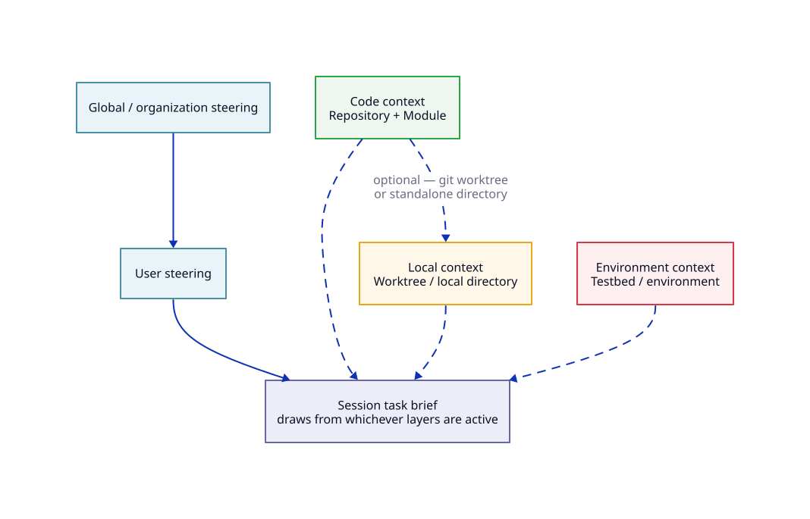

# Chapter 3: Steering

## Reader problem

Repository rules often live in human memory.

Senior engineers know which commands are safe, which files are dangerous, which modules own which responsibilities, which tests matter, and which reviewers expect evidence before merge. Agents do not know that by default. A stronger prompt does not repair missing repository doctrine.

Agents cannot respect repository rules they cannot see.

When build commands, test commands, unsafe files, ownership boundaries, and review expectations are invisible, AI-assisted work becomes inconsistent. One session follows the local conventions because a senior engineer remembered to explain them. The next session misses them because the same guidance stayed in private chat.

Steering is the first repository-level control surface. It moves repeated expectations out of memory and into durable, scoped instructions that humans and agents can both inspect.

## Design principle: steering is repository doctrine

Steering is doctrine, rules, and context.

It is the persistent, scoped instruction layer that shapes how an agent explores a repository, chooses commands, respects boundaries, validates work, and presents results.

Good steering is:

- stable enough to be reused across tasks
- scoped to the repository, module, worktree, environment, or session it governs
- versioned when it defines a shared team contract
- close to the code it governs
- short enough to be followed
- reviewed like other engineering guidance

Steering does not replace judgment. It gives judgment a place to start.

The boundary matters:

| Concept | Role |
|---|---|
| steering | doctrine/rules/context |
| skill | reusable task playbook |
| slash command | workflow trigger |
| agent | bounded role |
| subagent | isolated delegated worker |
| hook | lifecycle automation/guardrail |
| permissions/approvals/sandboxing | blast-radius control |
| context/memory | what the agent knows/carries |
| specs/plans/tasks | work structure |
| artifacts | durable outputs |
| verification | evidence and checks |
| MCP/tools | external capability layer |

Bad systems hide all of these concerns in one prompt. Governed systems separate them.

## What belongs in steering

Steering should answer the questions a capable engineer asks before changing a repository:

- What does this repository own?
- Where are the local boundaries?
- Which commands prove a change?
- Which areas require caution or escalation?
- What evidence is expected before review?

| Steering content | What it gives the agent | Example |
|---|---|---|
| Repository purpose | A working model of why the codebase exists | `nexus-service` owns public service APIs and their compatibility contract. |
| Architecture boundaries | Limits on where changes should be made | API handlers may call application services, but must not bypass authorization middleware. |
| Module ownership | A map of responsibility and escalation | Changes under `api/contracts/` require API owner review. |
| Build/test/lint commands | Executable checks to run before reporting completion | Run `make test-contracts` for public API response changes. |
| Safe and unsafe files | A blast-radius warning before edits | Do not edit generated schemas by hand; change the source schema instead. |
| Coding conventions | Local implementation expectations | Preserve existing error response shape and naming conventions. |
| API/versioning conventions | Contract rules that must survive implementation | Additive response fields must be optional and backward-compatible. |
| Review expectations | What reviewers will look for | Include compatibility notes and test evidence in the PR description. |
| Evidence expectations | The minimum proof needed before handoff | Report contract test results, regression tests, docs updates, and known gaps. |
| Terminology | Repository-specific language | Use "public response field," "contract test," and "downstream client impact" consistently. |
| Local anti-patterns | Known failure modes to avoid | Do not infer client compatibility from one handler test. |
| Links to canonical docs | Pointers without copying large documentation | Link to API style guide, schema policy, and release checklist. |

For the backward-compatible API contract change, steering should tell the agent where API conventions live, which tests matter, which docs must be updated, and which compatibility rules must not be violated. The agent still has to reason. Steering makes the repository's starting constraints visible.

## What does not belong in steering

Steering should contain stable guidance, not everything the agent might ever need.

| Do not put this in steering | Put it here instead | Why |
|---|---|---|
| Secrets, tokens, passwords | Secret store or environment variables | Plain-text steering is usually committed, copied, indexed, and shown to agents. |
| Volatile runtime data | Tool, API, monitoring system, or MCP server | Runtime state goes stale quickly and should be fetched from a live source. |
| Large copied documentation | Canonical docs with links from steering | Copied docs rot and bury the rules the agent actually needs. |
| Long narrative explanations | Architecture docs, ADRs, or onboarding docs | Steering should be operational, not a second handbook. |
| Task-specific instructions | Session brief, issue, spec, or task plan | Steering is reused across tasks; task details are transient. |
| Reusable step-by-step procedures | Skill | A task playbook belongs in a skill, not repository doctrine. |
| Hard enforcement rules | Hooks, permissions, sandboxing, CI, or review gates | Text can instruct; it usually cannot prevent an unsafe action. |
| Environment provisioning details | Executable setup scripts or infrastructure automation | Provisioning should be repeatable and auditable, not manually retyped from prose. |
| One-off personal notes | Gitignored local notes | Personal context should not become a shared repository contract by accident. |

The test is simple: if the guidance should shape many tasks in this scope, it may belong in steering. If it executes a workflow, provisions an environment, stores a secret, or proves completion, it belongs elsewhere.

## Steering layers

Steering is not one file for all situations. It is a scoped stack.



| Layer | Scope | Typical location | What belongs there |
|---|---|---|---|
| Global or organization steering | Organization or machine-managed baseline policy | Managed agent configuration, enterprise policy, shared baseline files | Security posture, prohibited actions, baseline review expectations, tool defaults. |
| User steering | Personal defaults across projects | User profile, home directory instruction file, personal tool settings | Preferred reporting style, personal command habits, accessibility needs, broad defaults. |
| Repository steering | Shared versioned contract for the codebase | Root `AGENTS.md` or repository instruction file | Repo purpose, layout, commands, architecture boundaries, quality gates, review expectations. |
| Module or directory steering | Subtree-specific guidance near the code | Nested `AGENTS.md`, directory rules, path-specific instructions | Local ownership, module commands, local invariants, package-specific anti-patterns. |
| Local worktree steering | Private branch- or checkout-specific notes | Gitignored local note in the worktree | Temporary branch context, local setup quirks, draft constraints that should not be shared. |
| Testbed or environment steering | Environment contract for execution | `testbeds/<name>/steering.md`, runner docs, environment policy | Runner, setup, services, access boundaries, sandbox, secrets injection, required evidence. |
| Session steering | Transient task-local guidance | Current prompt, issue, task brief, acceptance criteria | The immediate objective, constraints, and acceptance criteria for this task. |

Repository steering is the first shared layer most teams should fix. It is durable enough to govern repeated work and specific enough to influence actual code changes.

## Loading and precedence

Tools load steering differently.

Some concatenate files. Some prefer the nearest file. Some support path-specific rules. Some require manual inclusion. Some have separate settings, hooks, permissions, and sandboxing. A repository that depends on one implicit loading model will surprise users when the team changes tools.

Use this tool-agnostic rule:

> Enforced controls outrank advisory text. Within advisory text, more specific scope should outrank broader scope. Within the current task, explicit session instructions should clarify but not silently override safety or repository rules.

That rule is more important than any single vendor's precedence table.

Teams should not rely on implicit precedence. Make exceptions explicit. Keep the canonical repository contract easy to find. If module steering overrides root guidance, say what it overrides and why. If a session instruction asks for something that conflicts with repository safety rules, stop and escalate instead of treating the latest prompt as permission.

## Steering is advisory, not enforcement

A steering file can tell an agent what to do. It usually cannot force the agent to do it.

This is not a weakness if the system is designed correctly. Steering is where the rule is described. Enforcement belongs in the control that can actually block, verify, or require approval.

Plain-text steering is advisory. Hard constraints belong in hooks, permissions, sandboxing, CI, or review gates.

| Need | Steering can help by... | Enforcement belongs in... |
|---|---|---|
| Coding convention | Describing the local convention and pointing to examples | Formatter, linter, tests, CI |
| Unsafe files | Naming risky areas and explaining escalation conditions | Permissions, hooks, code owners, review gates |
| API compatibility | Stating the invariant and required compatibility evidence | Contract tests, schema checks, CI, reviewer checklist |
| Secret handling | Warning that secrets must not be pasted, logged, or committed | Secret manager, sandbox, environment policy, log redaction |
| Required evidence | Stating what must be reported before handoff | PR template, CI status, reviewer checklist, artifact policy |

Prompts can instruct. They cannot govern alone.

## Steering across repositories, worktrees, and testbeds

Steering has to match how engineering work actually happens.

## Working location changes the active steering

The directory where the agent starts is not just a filesystem detail. It is part of the steering context.

When work starts at the repository root, the agent should see broad repository doctrine. When work starts inside a package or module, the agent should see narrower local rules. When work happens in a worktree, temporary notes may apply. When work happens in a testbed, executable setup and evidence rules matter more than prose.

| Work location | What the agent is probably doing | Steering that should apply | Common mistake |
|---|---|---|---|
| Repository root | Cross-cutting change, repo-wide search, architectural cleanup | Root `AGENTS.md`, repo build/test rules, global constraints | Putting module-specific details into root steering |
| Module directory | Local package/API/UI change | Root steering plus module-local steering | Launching from repo root and flooding the agent with irrelevant context |
| Git worktree | Parallel or experimental branch work | Shared repo steering plus gitignored local notes | Duplicating repo policy in temporary notes |
| Dev container or local sandbox | Reproducible local execution | Repo steering plus executable setup and sandbox boundaries | Describing setup only in prose instead of scripts |
| Testbed or CI-like runner | Validation, integration testing, rollout simulation | Environment contract, setup scripts, permission policy, evidence expectations | Treating testbed behavior as ordinary repository steering |
| Session prompt | Current task and acceptance criteria | Task-local constraints and explicit "do not touch" guidance | Using the prompt to carry permanent repository rules |

### Repositories

Root steering should hold stable shared guidance:

- repository layout
- build, test, lint, and documentation commands
- architecture boundaries
- quality gates
- review expectations

Module steering should hold local guidance close to the code. This is especially important in monorepos, multi-language repositories, generated-code areas, and packages with different test commands.

Do not duplicate repo-wide policy in every module. Put the general rule at the root and add only the local exception near the code.

### Local working directories and worktrees

Starting directory matters. Many tools load local instructions based on the current directory, parent directories, nearest files, or files discovered while accessing code.

Use the starting directory deliberately:

- Launch from the repository root for cross-cutting tasks.
- Launch from a narrower directory for local package work.
- Keep worktree-local notes private and gitignored.
- Do not duplicate repo-wide policy in worktree notes.

Local notes are for temporary context, not governance. If a branch discovers a rule that the team should keep, promote it into repository or module steering during review.

### Testbeds

Testbed steering should be mostly executable and auditable.

It should answer:

- where the agent runs
- what the agent can access
- how services are provisioned
- how secrets are injected without exposing values
- what evidence must be captured

A good testbed contract points to setup scripts, runner configuration, sandbox policy, firewall rules, and evidence locations. It does not ask every agent to reconstruct the environment from prose.

## Example: same repository, different starting directories

Assume `nexus-service` has this structure:

```text
nexus-service/
├─ AGENTS.md
├─ services/
│  └─ api/
│     ├─ AGENTS.md
│     └─ src/
├─ apps/
│  └─ web/
│     ├─ AGENTS.md
│     └─ src/
└─ docs/
```

If the task is:

> Add a backward-compatible response field to the public API.

Start the agent from:

```text
nexus-service/services/api/
```

The active steering should include:

- root repository steering from `nexus-service/AGENTS.md`
- API module steering from `services/api/AGENTS.md`
- the current session brief for the specific API change

Do not start from `apps/web/`.

Do not start from repo root unless the change requires repo-wide search or cross-module coordination.

If the task is:

> Update documentation for the API change.

Start from repo root or `docs/`, depending on how documentation is organized. The API module steering may still matter, but the documentation steering should govern formatting, changelog rules, and publishing expectations.

## Example: worktree-local steering

A worktree is useful when the agent needs an isolated branch or parallel task, but it should not become a second source of repository truth.

Example:

```text
nexus-service/
├─ AGENTS.md
└─ services/api/AGENTS.md

../nexus-service-api-contract-worktree/
├─ AGENTS.md
├─ services/api/AGENTS.md
└─ .agent-local.md
```

The shared steering remains:

- root `AGENTS.md`
- module `services/api/AGENTS.md`

The worktree-local note may contain temporary context:

````md
# .agent-local.md

## Temporary local notes

- Current branch explores adding `supportTier` to the public account response.
- Do not modify unrelated account endpoints.
- Use the small local fixture dataset.
- Stop before changing authorization behavior.

## Cleanup

- Delete or rewrite this file before merging or sharing the worktree.
````

`.agent-local.md` is a recommended internal convention, not a universal standard. If used, add it to `.gitignore` and bridge it into the specific agent tools your team uses.

Do not put secrets, tokens, passwords, or live endpoint credentials in worktree-local steering.

## Example: testbed steering

A testbed is not just another directory. It is an execution environment.

For the API contract change, Nexus may validate the change in an integration testbed:

```text
testbeds/api-contract/
├─ steering.md
├─ compose.yml
├─ seed-data.sh
└─ collect-evidence.sh
```

A minimal `testbeds/api-contract/steering.md` should not duplicate repository doctrine. It should describe the environment contract:

````md
# API contract testbed steering

## Environment purpose

Use this testbed to validate backward-compatible API response changes.

Do not use it for load testing or production-data analysis.

## Setup

- Start services with `docker compose -f testbeds/api-contract/compose.yml up -d`.
- Seed non-production fixtures with `testbeds/api-contract/seed-data.sh`.

## Access boundaries

- Use only synthetic or approved non-production payloads.
- Do not connect to production clients or production data stores.
- Do not copy secrets into steering files.

## Evidence required

Before handoff, collect:

- contract test output
- changed endpoint response sample
- relevant service logs
- API documentation diff
- exact commit and testbed profile used
````

The executable scripts do the setup. The steering file explains purpose, boundaries, and evidence.

If a rule must be enforced, do not rely on testbed steering alone. Use sandbox policy, runner configuration, hooks, CI, or review gates.

## Tool-agnostic steering stack

The practical stack is simple:

| Layer | Recommended pattern |
|---|---|
| Shared contract | Root `AGENTS.md` as canonical repository steering |
| Module contract | Nested `AGENTS.md` or tool-specific path rules near code |
| Adapter layer | `CLAUDE.md`, `GEMINI.md`, `.github/copilot-instructions.md`, `.kiro/steering/` only where needed |
| Local layer | Gitignored local/worktree note for temporary context |
| Testbed layer | Executable setup, sandbox, runner, firewall, secrets, and evidence policy |
| Assurance layer | Hooks, permissions, CI, review gates, and evidence collection |

`AGENTS.md` is recommended as the canonical shared contract, not because it is magic, but because it is portable and predictable. It gives the repository one obvious place for shared agent-facing doctrine.

Tool-specific files still have value. They adapt the canonical contract into the loading model of a given tool. The failure mode is letting every tool-specific file become a separate source of truth.

## Applying steering to the running example

The primary running example is the [backward-compatible API contract change](./running-example.md): adding a new optional response field to a service API without breaking existing clients.

For that change, `nexus-service/AGENTS.md` should make the compatibility contract visible before the agent edits code.

| Steering concern | What `nexus-service/AGENTS.md` should say |
|---|---|
| API conventions | Public response changes must preserve existing clients unless a breaking-change process is explicitly approved. |
| Versioning or schema rules | Additive response fields must be optional, documented, and reflected in the canonical schema source. |
| Response compatibility rule | Do not remove, rename, narrow, or change the meaning of existing response fields during an additive change. |
| Ownership boundaries | API contract changes require review from the service API owner and the owning module maintainer. |
| Test commands | Run contract tests and relevant regression tests for changed API handlers. |
| Documentation | Update API docs and changelog when response shape changes. |
| Unsafe areas | Do not edit generated API artifacts directly; update the source contract or generator input. |
| Evidence expected in PR | Include test commands run, compatibility notes, docs updates, and known downstream impact. |
| Escalation | Stop if the field may expose sensitive data or downstream compatibility is unclear. |

This is not a full API-change procedure. The step-by-step playbook belongs in a skill. Steering defines the repository contract that the skill and agent must respect.

## Nexus case study

### Before this chapter

Nexus has a problem statement and a vocabulary map, but repo-specific rules still live in human memory.

Engineers know that `nexus-service` has API compatibility expectations. Agents only know that when a human remembers to include them in the prompt.

### Design decision

Nexus makes repository steering the first durable control surface.

The team decides that repeated repository expectations should not depend on private prompts. Shared doctrine goes into a visible, versioned file.

### Implementation

Nexus adds a sample repo `AGENTS.md` to `nexus-service`.

The file is focused on the backward-compatible API contract change. It records the service purpose, API conventions, schema/versioning rules, ownership boundaries, contract test commands, docs expectations, unsafe generated files, review evidence, and escalation triggers.

The file stays short. It links to the API style guide and schema policy instead of copying them.

### After this chapter

Nexus has a visible repo-level contract that humans and agents can both use.

An agent asked to add an optional API response field now sees the local compatibility rules before implementation. A reviewer can point to the same contract when asking for missing test evidence or compatibility notes.

### Lesson

Steering is the first place to move repeated repository expectations out of private prompts.

Start with the rules that senior engineers repeat during review. Put those rules where the agent and the next engineer can both find them.

## Templates

### Root `AGENTS.md` template

```md
# AGENTS.md

## Repository contract

- Describe what this repository owns.
- Name the main modules and responsibility boundaries.

## Build and test

- Install:
- Build:
- Test:
- Lint:

## Architecture boundaries

- ...

## Change rules

- ...

## Review and evidence

- ...

## Do not

- ...
```

### Module-level `AGENTS.md` template

```md
# Module steering

## Module scope

- ...

## Local commands

- ...

## Local rules

- ...

## Escalation

- ...
```

### Local worktree note template

`.agent-local.md` is a recommended internal convention, not a universal standard. If used, add it to `.gitignore` and bridge it into the specific agent tools your team uses.

```md
# .agent-local.md

## Temporary local notes

- ...

## Current branch constraints

- ...

## Delete or rewrite before sharing
```

### Testbed steering template

```md
# testbeds/<name>/steering.md

## Environment purpose

- ...

## Setup

- ...

## Access boundaries

- ...

## Evidence required

- ...
```

## Where should this instruction live?

| Instruction | Best location | Reason |
|---|---|---|
| "Public API response changes must preserve existing clients." | Root or API module `AGENTS.md` | Stable repository doctrine |
| "Run contract tests for changed API handlers." | Root or API module `AGENTS.md` | Stable local verification expectation |
| "Generate API-change test cases." | Skill | Reusable task playbook |
| "Start the API-change workflow." | Slash command | Workflow trigger |
| "Do not access production payloads." | Steering plus permissions/sandboxing | Advisory rule plus enforceable boundary |
| "Use this temporary fixture dataset for this branch." | Gitignored local worktree note | Temporary checkout-specific context |
| "Start services with this compose file." | Testbed setup script and testbed steering | Executable environment setup |
| "Capture logs, contract test output, and docs diff." | Testbed steering plus PR evidence template | Evidence expectation |
| "Block merge if contract tests fail." | CI or review gate | Hard enforcement |

## Quick Reference

### Core argument

Steering is the persistent, scoped instruction layer for repository doctrine, rules, and context.

### Put it in steering when...

| Put it in steering when... | Put it elsewhere when... |
|---|---|
| It is stable repository doctrine. | It is a reusable task sequence: use a skill. |
| It captures repeated local constraints. | It triggers a workflow: use a slash command. |
| It defines architecture boundaries. | It is hard enforcement: use a hook, permission, sandbox, or CI gate. |
| It records local commands. | It is a secret: use a secret store or environment variable. |
| It states review expectations. | It is one-off task detail: use a session brief. |
| It points to required proof. | It is evidence: store a verification artifact. |
| It links to canonical docs. | It is external capability: use a tool or MCP contract. |

### Working-location rule

Start the agent from the narrowest directory that still contains the task's real scope.

- Use repo root for cross-cutting work.
- Use module directories for local package or API work.
- Use worktrees for isolated parallel tasks.
- Use testbeds for executable validation.
- Use session prompts for the current task, not permanent repo doctrine.

### Testbed rule

Testbed steering should describe purpose, boundaries, setup entry points, and required evidence. The setup itself should live in executable scripts, runner configuration, sandbox policy, or CI.

### Steering quality checklist

- Is it stable?
- Is it scoped?
- Is it short enough to follow?
- Is it close to the code it governs?
- Does it avoid secrets?
- Does it avoid duplicating docs?
- Does it point to executable checks?
- Does it say when to stop or escalate?
- Can it be reviewed like code?

### Nexus asset

Sample repo `AGENTS.md`.

### Reader action

Create or review one repository steering file. Move one repeated repository expectation out of private prompts and into versioned steering.

## Source Notes

This chapter synthesizes official documentation and research on repository instructions, memory files, steering files, custom instructions, hooks, permissions, sandboxing, and environment setup. The chapter's decision frameworks, Nexus example, templates, and tool-agnostic steering stack are original to this field manual.

The supporting source catalog is maintained outside the chapter in [`references/bibliography.md`](../references/bibliography.md).
