# Chapter 4: Skills

## Reader problem

Repeated prompts become process debt.

If a task is performed often, the team should not rely on each developer remembering the right prompt, checklist, examples, edge cases, and quality bar. Private prompt fragments do not create repeatable engineering behavior. They create folklore.

Chapter 3 moved shared repository doctrine into steering. That was necessary, but it is not enough.

Steering tells the agent how to behave in a repository. A skill tells the agent how to perform a recurring task.

For the backward-compatible API contract change, steering can say: preserve existing clients, run contract tests, update docs, and include PR evidence. A skill turns that expectation into a reusable task playbook: inspect the contract, identify compatibility risks, generate test cases, check documentation impact, and produce a reviewable test plan.

## Design principle: skills are reusable task playbooks

A skill is a reusable task playbook.

It describes when to use a procedure, what inputs are required, what steps to follow, what outputs to produce, and how to verify the result. A good skill packages procedural knowledge so the agent does not need the same instructions pasted into every session.

Skills are not magic abilities. They are engineering artifacts.

Good skills are:

- narrow enough to route reliably
- stable enough to reuse
- explicit about inputs and outputs
- procedural without becoming bloated
- supported by examples, templates, scripts, or references when needed
- reviewed and improved like code
- tested for routing and output quality before broad rollout

The boundary matters:

| Concept | Role |
|---|---|
| steering | doctrine/rules/context |
| skill | reusable task playbook |
| slash command | workflow trigger |
| agent | bounded role |
| subagent | isolated delegated worker |
| hook | lifecycle automation/guardrail |
| permissions/approvals/sandboxing | blast-radius control |
| context/memory | what the agent knows/carries |
| specs/plans/tasks | work structure |
| artifacts | durable outputs |
| verification | evidence and checks |
| MCP/tools | external capability layer |

Bad systems hide task procedures inside prompts. Good systems move repeated procedures into skills.

## Progressive disclosure

Skills work because they do not have to load everything up front.

Most skill-compatible systems follow the same practical shape:

1. At startup or task planning time, the agent sees lightweight routing metadata such as a skill name and description.
2. When the task matches, the agent loads the full `SKILL.md`.
3. If needed, the agent reads referenced files, templates, examples, or assets.
4. If needed, the agent runs bundled scripts or validators.
5. The agent produces an output and checks it against the skill's quality gates.



Progressive disclosure is the difference between a usable skill library and a giant prompt dump.

The authoring implication is direct: the description is routing logic. The `SKILL.md` body is the playbook. References, assets, and scripts are loaded only when the work needs them.

## When to create a skill

Do not create a skill because a prompt is long. Create a skill because a workflow is repeated, reviewable, and worth improving.

| Create a skill when... | Do not create a skill when... |
|---|---|
| The task repeats across people, repos, or teams. | The task is a one-time exploration. |
| The quality bar can be written down. | The work has no stable procedure yet. |
| The output should follow a pattern. | Repository doctrine is the real need. |
| The procedure benefits from examples, templates, or scripts. | A simple command wrapper is enough. |
| The workflow should improve over time. | The work is better handled by a dedicated external tool. |
| The result is consumed by reviewers, CI, or downstream agents. | The agent only needs temporary task context. |

The practical test is this:

> If the team keeps pasting the same checklist into chat, the workflow is probably ready to become a skill.

## Anatomy of a high-quality skill

The minimum format is simple: a skill directory anchored by `SKILL.md`, with routing metadata and Markdown instructions. A serious engineering skill needs more than the minimum.

| Skill layer | Core question | What to author | Common failure mode |
|---|---|---|---|
| Routing | When should this skill activate? | `name`, `description`, trigger cues, near-miss negatives | False positives or skills never triggering |
| Contract | What must go in and what must come out? | Required inputs, output format, success criteria | Outputs are vague, inconsistent, or unusable |
| Reasoning | How should the agent make decisions? | Priorities, defaults, tradeoffs, stop conditions | The agent chooses a plausible but wrong path |
| Procedure | What steps should be executed? | Ordered workflow, checkpoints, script calls | The agent skips mandatory steps |
| Edge cases | What breaks reasonable assumptions? | Gotchas, exclusions, risky cases, escalation rules | The skill works only on easy cases |
| Quality gates | How does the agent know it is done? | Validation checklist, assertions, review evidence | Premature completion and fake confidence |

This layered view keeps skills from becoming prompt soup. Each layer has a job.

## Portable skill layout

Use the portable core first. Add tool-specific adapters only when the team needs them.

```text
api-change-test-plan/
├─ SKILL.md
├─ scripts/
│  ├─ list_changed_handlers.py
│  └─ validate_report.py
├─ references/
│  ├─ api-compatibility-checklist.md
│  └─ test-taxonomy.md
└─ assets/
   └─ test-plan-template.md
```

The directory should be boring.

- `SKILL.md` contains routing metadata, the contract, the procedure, and quality gates.
- `scripts/` contains deterministic mechanics the agent should not improvise.
- `references/` contains deeper guidance loaded only when needed.
- `assets/` contains templates, examples, or static resources.

Keep the portable core clean. Vendor-specific files, invocation hints, or UI metadata should be adapters, not the source of truth.

## Example: Nexus API-change test-plan skill

Nexus starts with one skill because one workflow repeats: planning tests for a backward-compatible API contract change.

The skill is not the implementation agent. It is not a slash command. It is not a hook. It is a reusable playbook for generating a reviewable test plan.

```md
---
name: api-change-test-plan
description: Create a test plan for backward-compatible public API response changes. Use when an API handler, schema, DTO, or public response field changes. Do not use for UI-only changes or private helper refactors.
---

# API Change Test Plan

## Purpose

Generate a reviewable test plan for a backward-compatible public API contract change.

## Inputs

- Changed files, diff, or task summary
- Repository steering from `AGENTS.md`
- API module steering, if present
- Link to the canonical API convention or schema rule
- Known downstream clients or compatibility concerns, if available

## Output contract

Return:

1. Change summary
2. Compatibility risks
3. Required contract tests
4. Required regression tests
5. Authorization and data-exposure checks
6. Documentation and changelog updates
7. PR evidence checklist
8. Stop or escalation conditions

## Procedure

1. Identify the public API surface being changed.
2. Classify the change as additive, behavioral, breaking, or unclear.
3. Check the compatibility rule from repository steering.
4. List contract tests for existing clients and the new optional field.
5. List regression tests for changed handlers, serializers, schemas, and authorization paths.
6. Identify documentation, changelog, and example-response updates.
7. Produce the output using the required contract.

## Edge cases

- A new optional field can still expose sensitive data.
- Schema changes can be breaking even when handler code looks additive.
- Generated files should not be edited directly unless repository steering explicitly allows it.
- If downstream compatibility is unclear, stop and ask for owner review.

## Quality gates

- Do not finalize without a compatibility classification.
- Do not claim tests passed unless actual test output is available.
- Include unknowns explicitly.
- Include exact files or areas that need reviewer attention.

## Resources

- Compatibility checklist: `references/api-compatibility-checklist.md`
- Test taxonomy: `references/test-taxonomy.md`
- Output template: `assets/test-plan-template.md`
```

This is deliberately smaller than a complete API governance program. Nexus is still early in the maturity curve. The skill captures one repeated workflow and gives it a stable shape.

## Skills and steering work together

Steering and skills should not duplicate each other.

| Question | Steering should answer | Skill should answer |
|---|---|---|
| What does this repository own? | Repository purpose and boundaries | Not its job |
| What API rule must not be violated? | Stable compatibility doctrine | How to apply that rule during a task |
| Which command proves this change? | Local test command expectations | When that command belongs in this workflow |
| What should the agent produce? | General review/evidence expectations | Task-specific output contract |
| What should happen if compatibility is unclear? | Escalation rule | Stop point inside the procedure |

For Nexus, `nexus-service/AGENTS.md` says public response changes must preserve existing clients. The `api-change-test-plan` skill tells the agent how to turn that doctrine into a concrete test plan.

## Scripts, references, and assets

A skill should not force the model to improvise deterministic work.

| Resource | Use it for | Avoid |
|---|---|---|
| `scripts/` | Parsing diffs, validating reports, generating repeatable summaries, checking output shape | Interactive prompts, hidden network access, opaque side effects |
| `references/` | Checklists, taxonomies, policy details, examples too long for `SKILL.md` | Copying entire external docs or stale onboarding manuals |
| `assets/` | Templates, report formats, sample files, fixture shapes | Secrets, credentials, live customer data |

Scripts included in a skill should behave like good CLI tools:

- non-interactive by default
- clear `--help`
- deterministic output
- useful exit codes
- structured output when downstream automation needs it
- diagnostics on stderr when practical
- no secret printing

If a script can mutate files, say so in the skill. If it needs network access, say so. If it should run only in a sandbox or testbed, say so.

## Trigger design and output contracts

The skill description is not marketing copy. It is the routing boundary.

Good descriptions answer:

- What task does this skill perform?
- When should the agent use it?
- When should the agent not use it?
- What kind of output should the user expect?

Weak:

```yaml
description: Helps with APIs.
```

Better:

```yaml
description: Create a test plan for backward-compatible public API response changes. Use when an API handler, schema, DTO, or public response field changes. Do not use for UI-only changes or private helper refactors.
```

Output contracts matter for the same reason. If the result will be reviewed, committed, checked by CI, or passed to another agent, the format must be predictable.

## Testing a skill

Untested skills are prompt bundles with nicer packaging.

Test skills at two levels: routing and execution.

| Test suite | What it checks | Example |
|---|---|---|
| Load test | The skill is discoverable and `SKILL.md` parses | Name and description are valid; referenced files exist |
| Trigger-positive test | The skill activates for intended requests | "Create a test plan for adding an optional API response field." |
| Trigger-negative test | The skill does not activate for near misses | "Fix a CSS spacing issue in the web app." |
| Contract test | The output has required sections | Compatibility risks, tests, docs, PR evidence |
| Procedure test | Required steps are not skipped | Contract surface is identified before tests are listed |
| Edge-case test | Known gotchas are handled | Sensitive field exposure triggers escalation |
| Script test | Bundled scripts behave predictably | `validate_report.py` exits nonzero for missing sections |
| Regression test | New versions do not degrade behavior | Compare current skill against previous skill or no-skill baseline |

The minimum test set for Nexus is small:

- a should-trigger request for the backward-compatible API contract change
- a should-not-trigger request for a UI-only change
- a contract assertion that the generated plan includes compatibility, authorization, docs, and PR evidence
- a validator check for the output template

That is enough to stop the skill from becoming another unreviewed prompt.

## Versioning and rollout

Skills need lifecycle management once they are shared.

| Stage | Recommended action | Why |
|---|---|---|
| Draft | Keep the first version narrow and local | Prevents premature platform-wide process |
| Review | Review `SKILL.md`, scripts, references, and assets | Skills can carry instructions and executable code |
| Validate | Run routing tests, output contract tests, and script tests | Prevents broken routing and unusable outputs |
| Publish | Put the skill in version control or a managed catalog | Creates provenance and review history |
| Promote | Make it default only after evidence | Avoids surprising downstream teams |
| Observe | Track failures, false triggers, and reviewer feedback | Skills improve through operational evidence |
| Retire | Remove stale or unsafe skills deliberately | Old playbooks become risk |

Do not silently overwrite a shared skill that other teams depend on. Publish a new version, record the change, and keep rollback possible.

## Governance and security

Shared skills are supply-chain artifacts.

They may contain instructions, scripts, references, templates, and implicit tool expectations. Treat them like code, not like harmless prompt text.

Before sharing a skill:

- confirm the owner
- review bundled scripts and dependencies
- scan for secrets and sensitive examples
- check that network and filesystem assumptions are explicit
- define the intended scope of use
- assign a risk tier if the skill touches security, privacy, production data, releases, or external systems
- decide who can publish updates

Skills should not contain secrets. They should not bypass steering. They should not quietly expand tool access. They should not hide production-data assumptions in examples.

Hard controls still live elsewhere. Use permissions, sandboxing, hooks, CI, and review gates when a rule must be enforced.

## Anti-patterns

| Anti-pattern | Why it fails | Better pattern |
|---|---|---|
| Mega-skill | Too broad to route reliably and too large to follow | Split by coherent task contract |
| Prompt dump | Moves a long prompt into `SKILL.md` without structure | Add routing, inputs, procedure, output contract, and quality gates |
| Vendor-first skill | Locks the core workflow to one tool's extension fields | Keep a portable core and isolate adapters |
| No negative triggers | Skill activates for near misses | Add when-not-to-use cases and trigger-negative tests |
| No output contract | Reviewers receive inconsistent prose | Define a required structure |
| Script as black box | Agent cannot judge side effects or failures | Document purpose, inputs, outputs, and failure modes |
| Secrets in examples | Turns reusable guidance into a leak vector | Use synthetic fixtures and secret stores |
| No owner | Skill decays with no accountable maintainer | Assign owner, review cadence, and retirement path |

## Nexus case study

### Before this chapter

Nexus has repository steering for `nexus-service`, but recurring API-change planning still depends on private prompts and reviewer memory.

Developers know that a public response change needs compatibility tests, authorization checks, docs updates, and PR evidence. The agent only knows that when someone remembers to paste the checklist.

### Design decision

Nexus converts the repeated API-change test-planning workflow into a skill.

The team keeps repository doctrine in `AGENTS.md` and puts the reusable task procedure in `api-change-test-plan/SKILL.md`.

### Implementation

Nexus adds a sample `SKILL.md` for `api-change-test-plan`.

The skill defines routing, inputs, output contract, procedure, edge cases, quality gates, and resources. It references an API compatibility checklist and a test-plan template instead of copying every policy detail into the skill body.

### After this chapter

Nexus has a reusable task playbook.

An agent asked to plan the backward-compatible API contract change can load the skill, produce a consistent test plan, and expose missing evidence before implementation or review.

### Lesson

Move repeated task procedures out of private prompts and into reviewable skills.

Start with workflows that already produce review friction. A skill is valuable when it makes the next run more consistent than the last one.

## Templates

### Portable `SKILL.md` template

```md
---
name: skill-name
description: Describe the task, when to use it, and when not to use it.
---

# Skill Name

## Purpose

- ...

## When to use

- ...

## When not to use

- ...

## Inputs

- ...

## Output contract

- ...

## Procedure

1. ...
2. ...
3. ...

## Edge cases

- ...

## Quality gates

- ...

## Resources

- ...

## Scripts

- ...
```

### Trigger test template

```md
# Trigger tests

## Should trigger

- ...

## Should not trigger

- ...

## Near misses

- ...
```

### Skill review checklist

- Does the skill have one coherent job?
- Is the description routing logic, not marketing copy?
- Does it say when not to use the skill?
- Are inputs and outputs explicit?
- Does the procedure include stop conditions?
- Are edge cases named?
- Are quality gates concrete?
- Are references and assets necessary and current?
- Are scripts non-interactive and documented?
- Are secrets absent?
- Is ownership clear?
- Is there a test plan for routing and output quality?

## Quick Reference

### Core argument

Skills are reusable task playbooks. They turn repeated prompt procedures into reviewable engineering artifacts.

### Create a skill when...

| Create a skill when... | Put it elsewhere when... |
|---|---|
| A task repeats and has a stable procedure. | It is repository doctrine: use steering. |
| The output needs a consistent contract. | It is a workflow trigger: use a slash command. |
| The task benefits from examples, references, templates, or scripts. | It is hard enforcement: use hooks, permissions, CI, or review gates. |
| The procedure should improve through tests and reviews. | It is external capability: use a tool or MCP contract. |
| The workflow is reusable across sessions or people. | It is one-off task context: use a session brief. |

### Skill quality checklist

- One coherent job
- Clear trigger description
- Explicit when-not-to-use cases
- Required inputs
- Predictable output contract
- Ordered procedure
- Edge cases and stop conditions
- Quality gates
- Optional scripts that are deterministic and documented
- References and assets loaded only when needed
- No secrets or live sensitive examples
- Owner and review path
- Routing and output tests

### Nexus asset

Sample `SKILL.md` for `api-change-test-plan`.

### Reader action

Pick one repeated prompt your team uses for API changes, reviews, ADRs, release notes, or test planning. Convert it into a small skill with a routing description, output contract, procedure, and quality gates.

## Source Notes

This chapter synthesizes official documentation and research on Agent Skills, progressive disclosure, skill folder structure, routing descriptions, optional scripts/references/assets, evaluation, versioning, and governance. The chapter's layered skill model, Nexus example, decision tables, templates, and operating guidance are original to this field manual.

The supporting source catalog is maintained outside the chapter in [`references/bibliography.md`](../references/bibliography.md).
