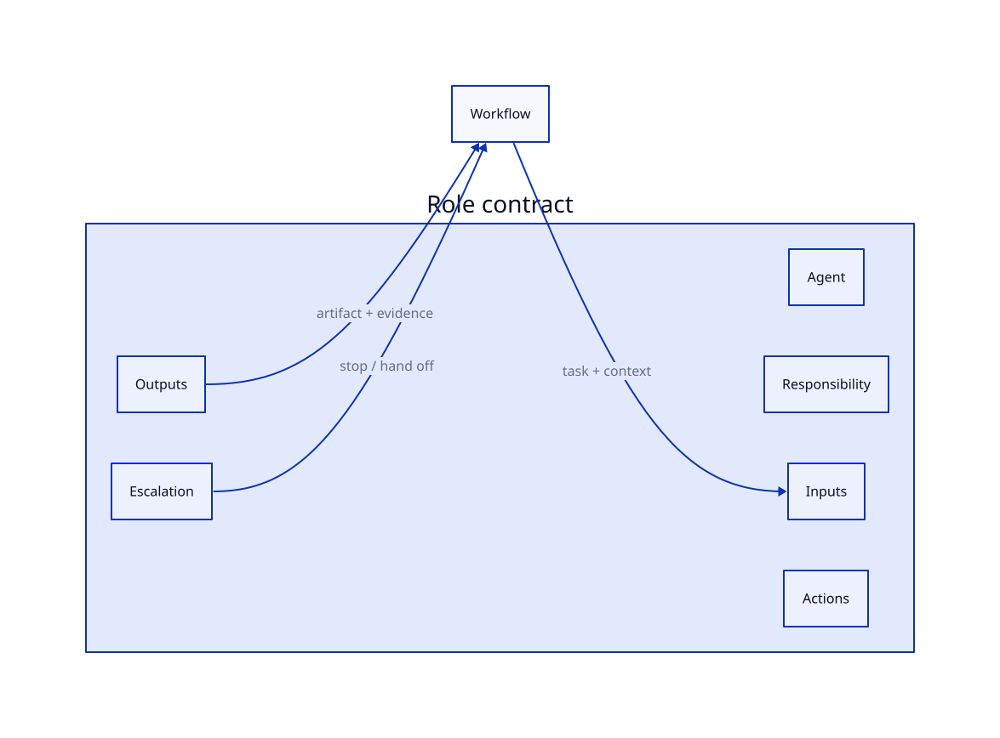
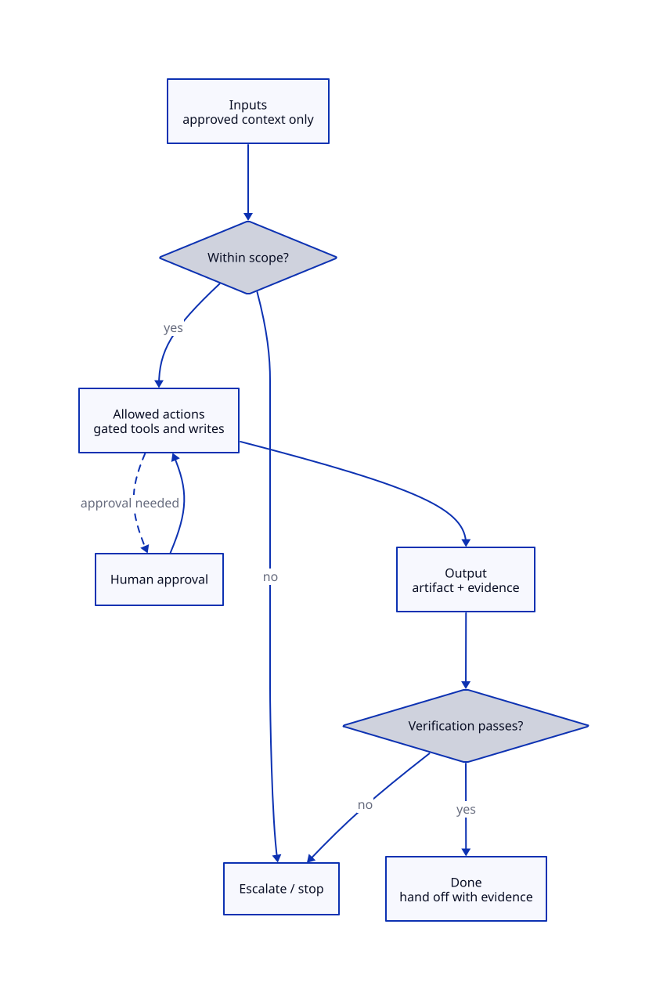
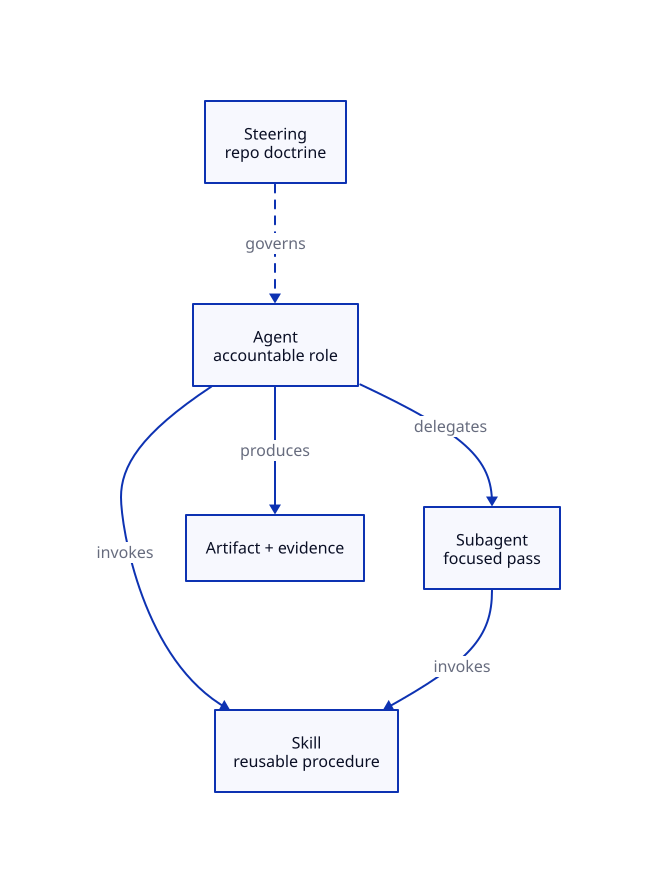

# Chapter 5: Agents

## Reader problem

An unbounded agent is a polite name for unclear responsibility.

Teams reach for one assistant to plan, implement, review, document, test, and decide. It feels efficient. It works on small tasks. It fails the moment any of that work has to be reviewed, attributed, or constrained — because no one can say what the assistant was responsible for, what it was allowed to touch, or when it should have stopped.

Chapter 4 moved recurring procedures into skills. A skill makes a task repeatable. It does not make anyone accountable for running it. That gap is the agent's problem to solve.

A skill is *what* gets done. An agent is *who* is accountable for doing it. Confusing the two produces capable workflows with no owner — code that gets written, reviews that get skipped, and completion that no one can verify.

For the backward-compatible API contract change, the team does not just need a test-plan skill. It needs a role that owns implementing the change within an approved scope, must preserve repository steering, may touch only the files it is permitted to, and must produce verification evidence before claiming the work is done. That role is the agent. The rest of this chapter is how to define it.

## Design principle: agents are bounded roles

An agent is a bounded role. Define its responsibility, inputs, allowed actions, expected outputs, and escalation points before it joins the workflow.

An agent is not a smarter prompt. It is an accountable role.

| Boundary | Question |
|---|---|
| Responsibility | What work does this agent own? |
| Inputs | What context may it use? |
| Actions | What files, tools, or commands may it touch? |
| Outputs | What artifact or evidence must it produce? |
| Escalation | When must it stop or hand off? |

These five boundaries form a closed surface. Everything the agent is allowed to be enters through one of them, and everything it produces leaves through one of them. The contract is the wall between the role and the rest of the workflow.



Each boundary is reviewed, versioned, and governed by a different mechanism. Responsibility is owned by a person. Actions are constrained by permissions and sandboxing. Outputs are checked by verification. Escalation is tested like any other behavior. Widening one boundary should never silently widen another — that is the failure the rest of this chapter is built to prevent.

## Anatomy of a high-quality role contract

A boundary list is not yet a contract. A usable role contract names what to author for each layer and what goes wrong when that layer is left implicit.

| Contract layer | Core question | What to author | Common failure mode |
|---|---|---|---|
| Responsibility | What does this role own, and not own? | Scope statement, explicit non-goals | Scope creep; the agent quietly owns everything |
| Inputs | What context is it allowed to use? | Required inputs, allowed steering, forbidden sources | Hidden context; unreviewable decisions |
| Actions | What may it do? | Allowed tools/commands, write scope, approval gates | Unbounded authority; unsafe writes |
| Outputs | What must it produce? | Artifact format, evidence, success criteria | "Done" with no verifiable output |
| Escalation | When must it stop? | Stop conditions, hand-off rules, who it escalates to | Plausible-but-wrong work completed silently |
| Verification | How is the work proven acceptable? | Checks, evidence record, reviewer attention points | Confidence substituted for evidence |

The layers are not just authoring categories. They describe how a request actually moves through the agent at run time: context enters, scope is checked, gated actions run, an output is produced, and verification decides whether the work can be handed off. Escalation is the off-ramp that every other layer can take when an assumption breaks.



An agent that has no path to the escalate box is not a safe agent. It is one that will complete the wrong work confidently rather than stop.

## Agent vs skill vs subagent

These three are constantly conflated. The boundary is simple once stated.

| Concept | Role | Owns responsibility? | Reusable procedure? |
|---|---|---|---|
| Agent | Bounded role | Yes | Invokes skills |
| Skill | Reusable task playbook | No | Yes |
| Subagent | Isolated delegated worker | Scoped, delegated | May invoke skills |

A skill is *what* gets done. An agent is *who* is accountable for doing it. A subagent is a bounded delegate the agent hands a focused task to. The skill is portable knowledge; the agent is the role that decides when to use it; the subagent is a temporary boundary the agent opens for separation or independent review.



Steering constrains the agent from above. The agent invokes skills and may delegate to subagents below it. Responsibility for the final artifact stays with the agent regardless of how much it delegates.

## When to create an agent

Do not define an agent because a task is hard. Define one because a responsibility is bounded, repeatable, and worth holding someone accountable for.

| Define an agent when... | Do not define an agent when... |
|---|---|
| The responsibility is bounded and repeatable. | The task is exploratory with no clear output. |
| Inputs and permissions can be stated. | The agent would need broad unreviewed authority. |
| The result can be verified. | The result depends on private reasoning only. |
| The output becomes a durable artifact or patch. | The work is a one-off explanation. |

> If you cannot say what the agent must *not* do, you have not defined an agent yet.

## Where an agent contract lives

Keep the portable role contract in a tool-neutral file first. Tool-specific agent definitions should adapt that contract, not become the source of truth.

```text
agents/
├─ implementation-agent.md
└─ review-agent.md
```

The exact directory can vary by repository convention. The important rule is that the portable contract remains reviewable as a durable artifact. A Codex, Claude, Gemini, Kiro, Copilot, or internal-runner adapter may reference that contract, import it, or translate it into a runtime-specific format. If the adapter adds runtime-specific permissions, hooks, loading behavior, or UI metadata, keep those details separate from the portable role contract.

That separation protects the agent-independent interface introduced in Chapter 2. The team should be able to move the role contract across runtimes without rewriting what the agent owns, what it may touch, what it must produce, or when it must stop.

## Reasoning patterns are not the contract

Patterns such as ReAct, Plan-and-Execute, and BDI shape how an agent reasons toward a result. They are internal strategy. They are not the role contract.

The contract is the external accountability boundary: responsibility, inputs, actions, outputs, escalation, verification. The reasoning pattern is how the agent moves inside that boundary. A team can switch an agent from Plan-and-Execute to ReAct without changing what it is allowed to touch or what it must produce. If changing the reasoning pattern changes the agent's authority, the contract was never doing its job.

Treat the pattern as an implementation detail and the contract as the reviewed interface.

## Permissions and blast radius

The Actions boundary in a role contract only *declares* what an agent may do. It does not *enforce* it. Enforcement is the subject of Chapter 9.

A role contract that says "may run tests, may not access production payloads" is a statement of intent. Permissions, approvals, and sandboxing are what make that statement true at run time. Keep the two aligned: the contract is the human-readable boundary, and the permission system is its enforcement. When they drift, the contract becomes fiction. See Chapter 9 for the enforcement mechanisms that back each declared action.

## Delegation handoff

An agent may do focused work itself or hand it to a subagent. Chapter 6 is reserved for subagent design; the rule that belongs here is narrower.

The parent agent remains accountable. It may delegate focused analysis or review, but delegation never transfers final responsibility. Do not delegate to add autonomy for its own sake, and never delegate in a way that hides who owns the outcome.

## Example: Nexus implementation-agent role contract

Nexus defines its first agent around the workflow that already has the most review friction: implementing a backward-compatible API contract change.

The agent is not the test-plan skill from Chapter 4. It is the role that decides when to invoke that skill, implements the change within scope, and produces the evidence a reviewer needs.

```md
---
name: implementation-agent
role: Implement scoped, backward-compatible changes with verification evidence
---

# Implementation Agent

## Responsibility

- Owns: implementing an approved API-change plan within nexus-service.
- Does not own: approving the change, judging its own compatibility risk,
  or deciding whether a breaking change is acceptable.

## Inputs

- The approved change plan or spec.
- Repository steering from `AGENTS.md`.
- API module steering, if present.
- Known downstream clients or compatibility concerns, if available.

## Allowed actions

- Edit application code within the approved scope.
- Run local tests, formatters, and static checks.
- Invoke the `api-change-test-plan` skill.
- Requires approval for: production payload samples, client usage data,
  schema deletions, and any write outside the approved scope.

## Output contract

- A patch or PR limited to the approved scope.
- Verification evidence: test output and compatibility notes.
- A completed PR evidence checklist.

## Escalation / stop conditions

- Compatibility is unclear: stop and request a review subagent.
- The change turns out to be breaking: stop and escalate to the API owner.
- The work would exceed the approved scope: stop.

## Verification

- Do not claim completion without actual test output.
- Preserve existing clients; attach contract-test results.
- Name the exact files or areas that need reviewer attention.
```

This is a role, not a procedure. The procedure lives in the skill; the contract above decides who runs it, under what limits, and what counts as done. It is deliberately smaller than a full engineering-agent platform — Nexus is still early on the maturity curve.

## Agents, steering, and skills work together

The three primitives should not duplicate each other. Each answers a different question about the same piece of work.

| Question | Steering answers | Skill answers | Agent answers |
|---|---|---|---|
| What rules apply repo-wide? | Repository doctrine | Not its job | Must obey; cannot override |
| How is a recurring task performed? | Not its job | The reusable procedure | Which skill to invoke, and when |
| Who is accountable for the outcome? | Not its job | Not its job | The role contract |
| What may be touched, and with what proof? | General expectations | Task-specific output contract | Allowed actions + verification |

For Nexus, `nexus-service/AGENTS.md` says public response changes must preserve existing clients. The `api-change-test-plan` skill turns that doctrine into a concrete test plan. The implementation-agent contract decides that this agent, within this scope, must run that skill and attach its evidence before claiming completion.

## Evaluating an agent

Untested agents are unbounded agents with paperwork. A role contract is only real if its boundaries are checked.

This chapter only defines agent-boundary evals: scope, action boundary, output contract, escalation, and authority regression. Chapter 13 generalizes verification across skills, commands, hooks, artifacts, and workflows.

Evaluate at the level of behavior, not output alone. The hardest thing to test, and the most important, is whether the agent stops when it should.

| Eval suite | What it checks | Example |
|---|---|---|
| Scope adherence | Stays within declared responsibility | Refuses work outside nexus-service scope |
| Action boundary | Touches only allowed files/tools | Does not write to generated files without approval |
| Output contract | Produces required artifact + evidence | PR includes compatibility notes and test output |
| Escalation behavior | Stops when it should | Halts and requests review when compatibility is unclear |
| Regression | New version does not widen authority silently | Compare action boundary against previous contract version |

An agent that never escalates is not safe. It is untested. The escalation eval is the one most teams skip and the one that catches the most dangerous failure: confident completion of work the agent should have refused.

## Versioning and rollout

A role contract is a privilege grant. Widening it is a privileged change and should be reviewed like one.

| Stage | Recommended action | Why |
|---|---|---|
| Draft | Keep the first role narrow and local | Prevents premature broad authority |
| Review | Review responsibility, action boundary, escalation rules | Authority changes are privileged |
| Validate | Run scope, boundary, and escalation evals | Prevents silent authority creep |
| Publish | Put the contract in version control | Creates provenance and review history |
| Promote | Make it default only after evidence | Avoids surprising downstream teams |
| Roll back | Preserve the last known-good contract; document recovery | Keeps a bad authority change recoverable |
| Observe | Track boundary violations and escalation misses | Agents improve through operational evidence |
| Retire | Remove stale or over-scoped agents deliberately | Old authority becomes risk |

Do not silently widen a shared agent's authority. Publish a new version of the contract, record what changed and why, and keep the previous boundary recoverable.

## Governance handoff

This chapter defines the role contract. Chapter 9 enforces it. Chapter 19 operationalizes it across teams.

A shared agent contract grants authority, references skills and tools, and encodes assumptions about what is safe. Treat it like a permission change, not like prompt text.

Before sharing or promoting an agent:

- confirm the owner
- review the action boundary and approval gates
- confirm escalation paths exist and resolve to a real owner
- check that permission assumptions are explicit and enforced (Chapter 9)
- assign a risk tier if it touches production, security, or releases
- decide who can widen its authority

An agent should not grant itself capability, bypass steering, or quietly expand its action boundary. Hard limits live in permissions, sandboxing, hooks, CI, and review gates — not in the politeness of the contract's wording.

## Anti-patterns

| Anti-pattern | Why it fails | Better pattern |
|---|---|---|
| Unbounded agent | Unclear responsibility, no review boundary | Declare responsibility and non-goals |
| Agent owns too many domains | No coherent accountability | Split into bounded roles |
| No escalation path | Wrong work completes silently | Define stop conditions and hand-offs |
| No verifiable output | "Done" cannot be trusted | Require an artifact and evidence |
| Authority creep | Permissions widen without review | Gate authority changes like permission changes |
| Agent as a smarter prompt | Responsibility confused with capability | Keep the role contract separate from reasoning |

## Nexus case study

### Before this chapter

Nexus relies on generic assistants with inconsistent behavior across repositories. The same request produces different scope, different writes, and different evidence depending on who phrased it. No one can point to what any assistant was responsible for.

### Design decision

Nexus introduces an implementation-agent role contract scoped to `nexus-service`. It declares responsibility and non-goals, allowed actions with approval gates, an output contract, escalation conditions, and verification expectations.

### Implementation

The contract invokes the `api-change-test-plan` skill from Chapter 4 rather than re-describing the procedure. It limits writes to the approved scope, requires approval for sensitive data, and forbids claiming completion without test output. Escalation routes unclear compatibility to a review subagent.

### After this chapter

Nexus has an accountable role instead of a generic helper. An agent asked to implement the API-change plan works within a stated scope, preserves steering, and produces verification evidence before review — and stops when an assumption breaks rather than guessing.

### Lesson

Define who is accountable before you decide what gets automated.

## Templates

### Role contract template

```md
---
name: agent-name
role: One-line accountable responsibility
---

# Agent Name

## Responsibility

- Owns: ...
- Does not own: ...

## Inputs

- ...

## Allowed actions

- ...
- Requires approval for: ...

## Output contract

- ...

## Escalation / stop conditions

- ...

## Verification

- ...
```

### Agent eval template

```md
# Agent evals

## Scope adherence

- ...

## Action boundary

- ...

## Output contract

- ...

## Escalation behavior

- ...
```

### Role contract review checklist

- Is the responsibility bounded, with explicit non-goals?
- Are inputs and allowed sources stated?
- Is the action boundary explicit, with approval gates?
- Is the output contract verifiable?
- Are escalation and stop conditions defined?
- Does escalation resolve to a real owner?
- Are permission assumptions enforced, not just declared?
- Is ownership clear, and is authority-change gated?

## Quick Reference

### Core argument

An agent is a bounded, accountable role — not a smarter prompt. Define its responsibility, inputs, actions, outputs, and escalation before it joins the workflow.

### Define an agent when...

| Define an agent when... | Put it elsewhere when... |
|---|---|
| The responsibility is bounded and repeatable. | It is a reusable procedure: use a skill. |
| Inputs and permissions can be stated. | It is repository doctrine: use steering. |
| The result can be verified. | It is a focused delegated pass: use a subagent. |
| The output is a durable artifact or patch. | It is a one-off explanation: no agent needed. |

### Role contract checklist

- Bounded responsibility with non-goals
- Stated inputs and allowed sources
- Explicit action boundary and approval gates
- Verifiable output contract
- Escalation and stop conditions
- Owner and gated authority changes
- Scope, boundary, and escalation evals

### Nexus asset

Sample role contract for `implementation-agent`.

### Reader action

Pick one generic assistant your team uses for a recurring change. Write it a role contract: responsibility, non-goals, action boundary, output contract, and escalation conditions. Then write the one eval that proves it stops when it should.

## Source Notes

This chapter synthesizes documentation and research on agent role design, agent reasoning patterns (ReAct, Plan-and-Execute, BDI), permission and blast-radius control, and agent evaluation. The layered role-contract model, the Nexus implementation-agent example, the decision and anti-pattern tables, the templates, and the operating guidance are original to this field manual.

The supporting source catalog is maintained in the repository at `references/bibliography.md`.
