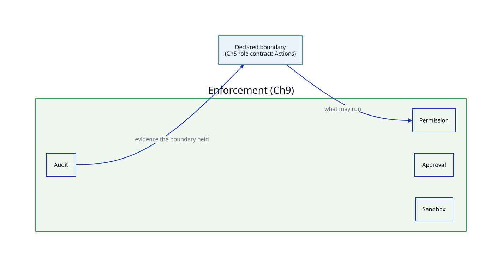

# Chapter 9: Permissions, Approvals, and Sandboxing

## Reader problem

Tool access without blast-radius control is not engineering discipline.

AI-assisted workflows can read files, run commands, call tools, open network connections, and modify systems. When that access is treated as a convenience — granted broadly so the assistant "just works" — every capability becomes a liability the team did not choose on purpose.

The gap is not capability. It is the absence of an enforced boundary. Chapter 5 gave each agent a role contract that *declares* what it may touch. A declaration is a sentence. A role contract that says "may not access production payloads" stops nothing on its own; it describes an intention. Without a mechanism that refuses the call, the sentence is fiction, and a reviewer who trusts it is trusting nothing.

This chapter is the machinery that makes the sentence true. Permissions, approvals, and sandboxing turn a declared boundary into an enforced one, and an audit trail proves it held.

## Design principle: limit blast radius before capability expands

Permissions, approvals, and sandboxing are blast-radius controls. Decide what an action can damage before you grant the ability to take it.

| Control | Role |
|---|---|
| Permission | Defines what action is allowed |
| Approval | Requires human authorization for higher-risk actions |
| Sandboxing | Limits where and how execution can happen |
| Audit trail | Records what was attempted or performed |

These are four different mechanisms, not four words for the same one. A permission decides whether an action is allowed at all. An approval inserts a human decision before a higher-risk action runs. A sandbox contains where and how execution happens so a mistake cannot reach further than intended. An audit trail records what was attempted, allowed, denied, or performed, so the other three can be reviewed rather than trusted. Conflating them is how teams end up with an "approval" that only sends a notification, or a "sandbox" that can still reach production.

In agentic engineering, most enforcement decisions happen at capability boundaries: shell commands, file writes, network calls, tool invocations, MCP connectors, CI APIs, issue trackers, documentation systems, and data stores. A tool call is not just a convenience. It is an authorization event. Chapter 18 covers how tools and MCP connectors are wired up; this chapter governs whether any given call is permitted to run at all.

Declaration is not enforcement. A role contract names a boundary; these controls make it real.



Scanners and input/output filters can help detect unsafe content, but they sit alongside these controls, not in place of them. Detection is not enforcement. A filter that flags a dangerous call has not stopped it.

## What enforcement defends against

Controls are easier to design well when you name what they are for. An agent is a non-human principal: it acts at machine speed, and its mistakes scale with its reach. Give each agent a unique, scoped identity — the way you would a service account, not a shared login — so that every action is attributable to one agent and every permission is granted to one role rather than to "the assistant" in general.

The recurring failure modes of agentic systems are well catalogued — the OWASP Top 10 for LLM applications and the NIST AI Risk Management Framework both describe them — and each maps cleanly to a control in this chapter.

| Failure mode | What goes wrong | Primary control |
|---|---|---|
| Excessive agency | The agent takes actions beyond what the task needs | Permission scope + approval |
| Sensitive disclosure | Secrets, customer data, or regulated material leak out | Read approval + redaction + sandbox |
| Unsafe tool or connector use | A capability is exposed more broadly than intended | Allowlist + sandbox + audit |
| Action via untrusted input | Retrieved or tool content steers the agent into harmful actions | The boundary holds regardless of content |
| Overreliance | The team trusts agent output with no evidence it was safe | Audit trail + verification (Chapter 13) |
| Unattributable action | No one can say which agent did what | Unique, scoped agent identity |

These are not separate problems needing separate machines. The same four controls address all of them; the threat model only tells you where to set each one.

## Declaration vs enforcement

This is the hinge between Chapter 5 and this chapter, and the place most teams quietly fail.

Chapter 5's role contract declares the boundary: "may run tests, may not access production payloads." That is intent, written for humans to review. Enforcement is the separate, runtime machinery that refuses the call when the agent reaches past the boundary. The two are authored by different people, live in different places, and change on different schedules — which is exactly why they drift.

When the declared boundary and the enforced boundary drift apart, the contract becomes fiction. The role contract still reads "may not access production," reviewers still trust it, and the runtime quietly allows the call anyway. Nobody notices until the access shows up in an incident.

The rule that prevents this: every declared action in a role contract should map to an enforced permission. Unmapped declarations are the gap that accidents and attackers both find first. A declaration with no enforcement behind it is the single highest-value thing to hunt for in a review, because it is the boundary everyone believes in and nothing holds.

## Untrusted content does not relax the boundary

The sharpest test of enforcement is an agent that has been told to cross the line.

Retrieved documents, tool output, web pages, issue comments, and pasted context can all carry instructions — accidental or adversarial — that tell the agent to exfiltrate data, widen its own scope, or run something destructive. This is prompt injection, and the defense is not to detect every malicious string. Detection helps; it does not hold.

The boundary must hold regardless of what the content says. A permission that can be talked out of is not a permission. If retrieved content can cause the agent to delete a schema, the failure is not that the content was persuasive — it is that deletion was reachable without an approval the content could not satisfy. Treat all ingested content as untrusted by default, and make sure no instruction inside it can grant capability the role contract did not. Enforcement is what makes the agent's eventual judgment irrelevant to the boundary: even a fully convinced agent cannot take an action the permission system refuses.

## Anatomy of an enforced boundary

A control list is not yet an enforced boundary. Each layer below has a job, an authoring task, and a failure mode that appears when the layer is left implicit.

| Layer | Core question | What to author | Common failure mode |
|---|---|---|---|
| Permission | What action is allowed, for whom? | Allowlist of actions, scopes, and callers | Implicit allow-all; capability by default |
| Approval | What needs a human yes, and from whom? | Risk threshold, named approver, escalation path | Approval theater; rubber-stamp with no owner |
| Sandbox | Where and how does execution happen? | Isolation level, filesystem and network limits, time box | Sandbox in name only; real production access |
| Audit | What was attempted or done? | Logged action, caller, inputs, decision, outcome | Logs that omit denials or that no one can query |
| Recovery | How is a bad action undone? | Rollback path, revocation, kill switch | Mutation with no recovery; trust without rollback |

The caller must be identifiable. A permission rule cannot govern "the assistant" in the abstract. It governs a named agent, subagent, workflow, hook, or tool adapter. If the runtime cannot tell which actor made the request, it cannot enforce role boundaries or produce useful audit evidence. This is the same principle Chapter 5 establishes for bounded agent roles: enforcement requires a named, scoped identity.

The hardest layer to get right is Approval, because most teams implement it as a notification rather than a gate. An approval that cannot block is not an approval — it is a message the agent has already moved past. If the action can complete while the human is still reading the alert, the gate is decorative.

The most-skipped layer is Recovery. Teams grant mutating capability on the strength of trust and discover only during an incident that nothing can undo the action. A tier that can change production without a rollback path is not a controlled tier; it is an unrecoverable one with paperwork.

## Permission tiers

Least privilege is the governing principle: grant the minimum rights the task needs, and no more. Tiering keeps the team from making a fresh access decision for every action. Each tier bundles an approval mode and a sandbox level so the question becomes "which tier is this?" rather than "is this specific call safe?"

| Tier | Example action | Approval | Sandbox |
|---|---|---|---|
| Read-only local | Read source, run tests | None | Local |
| Scoped write | Edit files within the approved scope | Self-serve, in-scope | Local |
| Sensitive data | Access payload samples, client usage data | Explicit + redaction | Restricted |
| Mutating / prod | Deploy, delete a schema, write to production | Named approver + audit | Isolated |

The ladder is deliberately short. Four tiers a team can hold in its head beat a fine-grained matrix nobody consults. The discipline is in the jumps between tiers: moving an action up a tier should be a reviewed decision, and moving the default down — toward read-only — should be the resting state. Capability climbs the ladder only when there is evidence it needs to.

## Approval: when to gate, and who stays in the loop

Approval is expensive. Every gate costs human attention, and a team that gates everything trains its reviewers to rubber-stamp — which is worse than no gate, because it manufactures false confidence. Reserve approval for actions where a human decision genuinely changes the risk.

| Require approval when… | Do not gate when… |
|---|---|
| The action is irreversible. | The action is read-only. |
| It touches sensitive or production data. | It is fully reversible. |
| It exceeds the agent's approved scope. | It stays within an already-approved scope. |
| Its blast radius is hard to predict. | Its blast radius is small and contained. |

> If the action cannot be undone and no one is named to approve it, it should not run.

The question of *when* to gate is separate from *how* the human stays involved. Approval is not one shape.

| Oversight mode | How it works | Use for |
|---|---|---|
| Human-in-the-loop | The action blocks until a human approves | Irreversible or high-blast-radius actions |
| Human-on-the-loop | The action proceeds; a human monitors and can halt or roll back | Time-sensitive, reversible, medium-risk work |
| Multi-approver (four-eyes) | Two or more independent approvers must sign off | The highest-risk actions, where one approver is too few |

Human-in-the-loop is the default for anything irreversible: the action waits. Human-on-the-loop trades blocking for speed, and is only safe when the action is genuinely reversible and the halt is genuinely fast — without a quick rollback path it is just unmonitored autonomy wearing an oversight label. Multi-approver signoff guards against a single mistaken or coerced approval on the actions where that single point of failure is unacceptable.

Whatever the mode, the approval must be demonstrable: a record of who approved, on what basis, tied to the action. An approval no one can later point to is, for review purposes, an approval that did not happen.

## What an approval request must show

An approval request should include enough information for the approver to decide — not merely a yes/no prompt. An approver who cannot see what they are authorising is not providing oversight; they are providing a signature.

At minimum, an approval request must include:

- requested action
- caller / agent identity
- target resource
- reason for the action
- risk tier
- expected change
- rollback or revocation path
- evidence already produced
- timeout or escalation behaviour if no response is given

This is what separates a real gate from approval theater. A rubber-stamp approval is usually a symptom of a poorly formed request — not a lazy approver.

## Sandboxing

A sandbox limits where and how execution happens: which files it can reach, whether it can open the network, how long it can run, which credentials it holds, and how far a failure can spread. The point is to make the worst case small before the agent ever acts.

A sandbox has two jobs: location isolation and behavior control. Location isolation decides where the agent runs. Behavior control decides what the agent can reach from there. A container with broad credentials and unrestricted egress is isolated in name but dangerous in practice — the blast radius of an escape is small, but the blast radius of a successful exfiltration is not.

A sandbox isolates *where* an agent runs; it does not by itself constrain *what* the agent does inside that boundary. An agent confined to a container can still read everything in that container and send it anywhere the network allows. Location isolation and behavioral confinement are two different jobs: the first limits the blast radius of a crash or escape, the second limits the actions the agent can take while perfectly contained. Default-deny network egress is usually the highest-leverage behavioral control, because exfiltration is what turns a contained mistake into an incident.

A sandbox is a claim, and a claim that cannot be inspected is not a control. "It runs in a sandbox" means nothing until someone can say what the sandbox actually denies. Default to deny for filesystem and network scope and open only what the task needs, because a sandbox that allows everything except a short blocklist is a production environment with optimistic naming.

This chapter stops at what a sandbox must constrain and must prove. How to build one — containers, microVMs, kernel-level syscall and network filters, language runtimes — is an infrastructure concern that varies by runtime; the engineering discipline is the same regardless of implementation: contain first, verify the containment, then grant.

## Audit and evidence

An audit trail records the action, the caller, the inputs, the decision, and the outcome. It is the provenance of an enforcement decision — which agent attempted what, what the system decided, and what resulted — and its value is that it supports a later judgment about whether the boundary held. Without it, the other three controls cannot be reviewed; they can only be trusted, which is the condition this chapter exists to replace.

For an agent, the record should reach back to the decision chain: what triggered the action, what the agent's stated reasoning or prompt was, and what it then did. The action alone tells you what happened; the chain tells you whether it should have. Keep the record append-only or otherwise tamper-evident, or it cannot serve as evidence — a log the actor can edit proves nothing about the actor.

Log denials, not only successes. A log of only what succeeded hides exactly the events that matter most: the accidents and the overreach that the controls stopped. A clean success log can mean the controls worked or that nothing was ever attempted, and you cannot tell which. The denial record is the evidence the boundary held.

The audit record is a durable artifact (Chapter 12) and supplies evidence for verification (Chapter 13). This chapter produces the record; those chapters govern its lifecycle and its use in checks.

## Where enforcement lives

Enforcement does not live in the prompt or in the text of the role contract. It lives in the runtime: permission systems, sandboxes, hooks (Chapter 8), CI gates, and human review. The decisions those systems make should be expressed as policy the runtime enforces, not as convention reviewers are expected to remember. A rule that lives only in a reviewer's head is enforced only while that reviewer is paying attention.

That location matters for portability. The declared boundary — the role contract — is meant to move across Codex, Claude, Gemini, Kiro, Copilot, or an internal runner. Enforcement is runtime-specific and does not move with it. The risk is silent: port the contract to a new runtime and the controls that backed it can quietly fail to come along, leaving a boundary everyone still believes in and nothing enforces. Treat re-establishing enforcement as a required step of any runtime move, not an assumed one.

## Example: Nexus permission matrix for the API contract change

Nexus turns the implementation-agent role contract from Chapter 5 into an enforced matrix. The contract declared what the agent may touch; the matrix is what refuses the call when it reaches past that.

```yaml
# Permission matrix: implementation-agent (enforces the Ch5 role contract)

read_source_and_run_tests:
  tier: read-only-local
  caller: implementation-agent
  approval: none
  sandbox: local
  audit: [caller, action, outcome]
  recovery: n/a

edit_code_in_approved_scope:
  tier: scoped-write
  caller: implementation-agent
  approval: self-serve-in-scope
  sandbox: local
  audit: [caller, files_changed, outcome]
  recovery: revert-patch

access_payload_samples_or_client_usage:
  tier: sensitive-data
  caller: implementation-agent
  approval: human-in-the-loop + redaction
  sandbox: restricted
  audit: [caller, dataset, approver, redaction_applied, outcome]
  recovery: revoke-access

schema_delete_or_prod_write:
  tier: mutating-prod
  caller: implementation-agent
  approval: four-eyes
  sandbox: isolated
  audit: [caller, action, approvers, trigger, outcome, denials]
  recovery: rollback + kill-switch
```

## How this enforces the role contract

Every action the role contract declared maps to a control here.

| Declared in the role contract (Ch5) | Enforced here (Ch9) |
|---|---|
| May edit code within the approved scope | Scoped-write permission, local sandbox, patch-revert recovery |
| May run local tests and static checks | Read-only-local permission, local sandbox |
| Requires approval for production payload samples | Sensitive-data tier: human-in-the-loop, redaction, restricted sandbox |
| Must not exceed the approved scope | Out-of-scope writes denied by permission; denial logged |

If a declared action has no row in this table, that is the gap. The mapping should be one-to-one and obvious; anything in the contract that cannot be pointed at a control is a boundary the team only imagines it has.

## Memory and data boundaries

The division of labor with Chapter 10 is simple. Chapter 10 decides what kind of knowledge a thing is, where it lives, and how long it persists. This chapter decides whether the agent may access or store it at all.

Enforcing a memory boundary means deciding what may be written to durable memory in the first place, what requires approval before it persists, what must be redacted on the way in, and what must never persist regardless of convenience. Apply the same tiering used for tool actions: durable writes of sensitive data sit in the sensitive-data tier, with approval, redaction, and an audit record, and the things that must never persist are denied by default rather than trusted to discretion.

## License and IP gates

Some permission decisions are driven not by operational risk but by legal obligation. License compliance and intellectual property boundaries need the same enforcement mechanism as capability boundaries.

| Gate type | What it enforces | Where it lives |
|---|---|---|
| Dependency license check | Only approved licenses reach the build | Hook or CI step; block on unapproved licenses |
| IP boundary enforcement | Code or data from restricted sources is not incorporated | Pre-commit or review gate; flag and require approval |
| Attribution requirement | External sources are cited when referenced | Checklist or approval field in the PR evidence template |
| Export control filter | Restricted modules are not deployed to certain destinations | Deployment gate; deny by default with explicit allow-list |

_Planned: how license gates connect to the permission tier model — most license checks belong at L3 (repo steering hook) or L4 (governed tool use with CI enforcement)_

_Planned: how IP rules stated in steering (Chapter 3) are enforced here via hooks and permission policy_

## Anti-patterns

| Anti-pattern | Why it fails | Better pattern |
|---|---|---|
| Capability by default | The agent may do anything not explicitly forbidden | Default-deny; allowlist the actions that are needed |
| Shared agent identity | Actions cannot be attributed to a specific agent | Give each agent a unique, scoped identity |
| Approval theater | Approval notifies but cannot block | Make approval a gate the action waits on, not a ping |
| Sandbox in name only | "Sandbox" retains real production or network access | Verify isolation; default-deny egress |
| Logging only successes | Denials and attempts vanish from the record | Log allow and deny, with caller, inputs, and outcome |
| Declared but unenforced | The contract says no; the runtime allows yes | Map every declared action to an enforced permission |
| Trusting content over policy | Instructions inside retrieved content widen what the agent does | The boundary holds regardless of content; untrusted input cannot grant capability |
| Mutation without rollback | An irreversible action is trusted blindly | Require a recovery path before granting the tier |

## Nexus case study

### Before this chapter

Nexus has unclear boundaries around what assistants may inspect or modify. Access is treated as a convenience: if an assistant needs something to finish a task, it tends to get it. Several agents share one set of credentials, so no one can say which agent did what, and there is no record of what any of them reached.

### Design decision

Nexus gives each agent a unique, scoped identity and introduces permission tiers and an approval matrix tied directly to the implementation-agent role contract. The contract's declared actions become enforced rows rather than good intentions.

### Implementation

Read-only and scoped writes are self-serve in a local sandbox. Access to sensitive payloads is human-in-the-loop with redaction inside a restricted sandbox with default-deny egress. Production and schema-destructive actions need two independent approvers, a full audit record including the trigger, and a rollback path. Denials are logged alongside successes. The matrix enforces the Chapter 5 contract rather than restating it.

### After this chapter

Nexus has a permission matrix that limits blast radius before tool use expands, identities that make every action attributable, and an audit trail that records what was attempted — including what was blocked. A reviewer can now point at the control that holds each declared boundary instead of trusting that someone implemented it.

### Lesson

A boundary no one enforces is a boundary no one has.

## Templates

### Permission matrix template

```yaml
action_name:
  tier: read-only-local | scoped-write | sensitive-data | mutating-prod
  caller: <unique agent / role identity>
  approval: none | self-serve-in-scope | human-in-the-loop | four-eyes
  sandbox: local | restricted | isolated
  audit: [caller, action, inputs, trigger, decision, outcome, ...]
  recovery: rollback | revoke | kill-switch | n/a
```

### Approval policy template

```md
# Approval policy

## Requires approval
- ...

## Does not require approval
- ...

## Oversight mode and approver
- mode: human-in-the-loop | human-on-the-loop | four-eyes
- approver / escalation: ...
```

### Enforcement review checklist

- Does every declared action map to an enforced permission?
- Does every agent have a unique, scoped identity?
- Is the default deny, not allow?
- Is the oversight mode right for the risk — does anything irreversible block?
- Can each approval actually block, not just notify?
- Is the sandbox's isolation verifiable, and is egress default-deny?
- Can any instruction in ingested content grant capability the contract did not? (It must not.)
- Does the audit capture the decision chain, and are denials logged?
- Does every mutating tier have a recovery path?
- Is there a named owner for each approval gate?

## Quick Reference

### Core argument

Permissions, approvals, and sandboxing turn a declared boundary into an enforced one. Declaration is intent; enforcement is discipline. An audit trail proves the boundary held, and an enforced boundary holds even when the agent is told to cross it.

### Risk → control

| Risk | Control |
|---|---|
| Accidental writes | Sandbox and write approval |
| Sensitive data exposure | Read approval, redaction, default-deny egress |
| Unsafe command execution | Command allowlist and escalation path |
| Action via untrusted input | Default-deny permissions; no content-granted capability |
| Unattributable action | Unique, scoped agent identity |
| Unclear accountability | Audit log with decision chain and PR evidence |

### Enforcement checklist

- Least privilege; default-deny permissions
- Unique, scoped identity per agent
- Approval gates that can block, matched to risk
- Verifiable sandbox isolation, default-deny egress
- Untrusted content cannot grant capability
- Audit of allow and deny, with decision chain
- Recovery path for mutating actions
- Declared boundary maps to enforced permission

### Nexus asset

Permission matrix and approval policy for the `implementation-agent` role.

### Reader action

Take one agent's role contract from Chapter 5. For each declared action, write the enforced permission, oversight mode, and sandbox. Find the first declared boundary with no enforcement behind it — that is your highest-priority gap.

## Source Notes

This chapter synthesizes documentation and research on least-privilege and capability-based security, access-control models, sandboxing and execution isolation, human-in-the-loop and human-on-the-loop oversight, and audit and provenance. The threat framing draws on the common agentic failure modes catalogued in the OWASP Top 10 for LLM applications and the NIST AI Risk Management Framework. The permission-tier model, the enforced-boundary anatomy, the Nexus permission matrix, the declared-versus-enforced mapping, and the templates are original to this field manual.

The supporting source catalog is maintained in the repository at `references/bibliography.md`, under `Permissions, approvals, sandboxing, and enforcement`.
