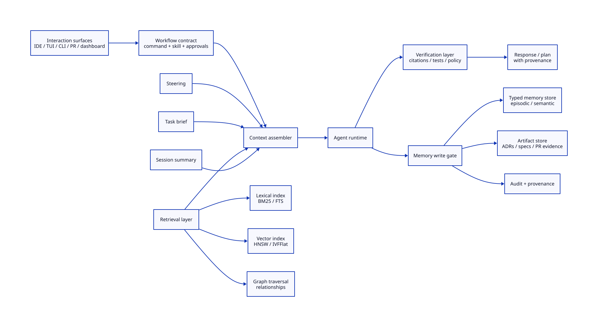
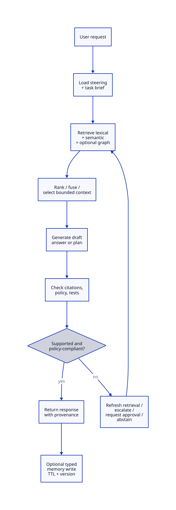

# Chapter 10: Context and Memory

## Reader problem

More context is not automatically better.

Teams often paste architecture notes, logs, tickets, code snippets, prior decisions, and chat summaries into a session until the assistant appears informed. That can help locally while making boundaries, provenance, sensitivity, and retention unclear.

Context flooding creates a false sense of safety. The agent may see more text while still missing the right evidence, relying on stale summaries, leaking sensitive data into the wrong surface, or treating a copied note as a source of truth. Large context windows reduce some friction. They do not replace retrieval discipline, provenance, summarization hygiene, permissions, or durable artifacts.

Chapter 3 put stable doctrine in steering. Chapter 4 put repeated procedures in skills. Chapter 5 bounded agent responsibility. Chapter 10 answers a different question: what may the agent know, retrieve, carry, remember, and write back?

For the backward-compatible API contract change, the agent needs repository steering, the task brief, selected API convention docs, relevant schema metadata, current diffs, and verification evidence. It should not silently absorb production payloads, private client data, stale chat summaries, or one-off guesses into durable memory.

## Design principle: context is bounded; memory is governed

Context is the bounded working set for the current task.

Memory is selectively retained information with type, scope, retention, provenance, and verification rules.

Treat both as engineering inputs. Do not treat either as a dumping ground.

| Design question | Why it matters |
|---|---|
| What belongs in steering, task brief, retrieval, memory, or artifacts? | Each concern has a different owner, retention rule, and review path. |
| How is memory written, versioned, retrieved, refreshed, and expired? | Hidden retention becomes stale authority. |
| How is memory governed across interaction surfaces? | IDE, TUI, CLI, pull request, and dashboard surfaces expose different risks. |
| How is correctness verified? | Retrieved or remembered text is not proof until it is checked against source. |
| Can this design survive an agent-runtime change? | Portable memory contracts outlive Codex, Claude, Gemini, Kiro, Copilot, and future runtimes. |

The rule is simple:

> Context is assembled for the task. Memory is retained by policy. Artifacts are the system of record.

## Context taxonomy

The first governance move is to name the kind of information being handled.

| Type | Best use | Keep for | Do not use for | Typical location |
|---|---|---|---|---|
| Steering | Stable repository doctrine | Long-lived, versioned | Session-specific facts | `AGENTS.md`, repo docs |
| Task brief | Current objective, scope, constraints | Current task | Durable cross-session memory | Issue, spec, plan, prompt |
| Retrieved context | Relevant files, docs, tickets, metadata | Current run unless promoted | Unverified source of truth | Retrieval layer, tool result |
| Working memory | Current session summary and state | Minutes to hours | Policy or canonical decisions | Session store, transient summary |
| Episodic memory | Important completed-task notes, decisions, exceptions | Days to weeks unless promoted | Canonical policy | Typed memory table with TTL |
| Semantic memory | Stable facts, relationships, conventions | Review-based long retention | One-off observations | SQL, vector, graph-backed record |
| Artifact | ADRs, PR evidence, specs, runbooks | Long-lived, durable | Hidden assistant state | Docs, evidence store, repository |

This table prevents three common mistakes:

- putting stable doctrine into memory instead of steering
- treating retrieved snippets as durable artifacts
- keeping private chat summaries as if they were reviewed engineering records

## Context package

A context package is the assembled working set for one run. It is the bounded input the agent uses for the task.

A good context package says:

- what task is being attempted
- which steering applies
- which retrieved sources were included
- which memory records were read
- which sensitive sources were excluded or approved
- what is stale, missing, or uncertain

For risky work, the context package should be reviewable. The reviewer should be able to see whether the agent operated from current repository facts or from a stale summary.

```md
# Context Package

## Task

- ...

## Steering loaded

- Root: `AGENTS.md`
- Module: ...

## Task brief

- ...

## Retrieved sources

| Source | Version/hash | Why included |
|---|---|---|
| ... | ... | ... |

## Memory records read

| Memory ID | Kind | Scope | Expires |
|---|---|---|---|
| ... | ... | ... | ... |

## Exclusions and approvals

- Sensitive sources excluded: ...
- Approved sensitive reads: ...

## Unknowns

- ...
```

## Retrieval architecture

Retrieval is not memory by itself. Retrieval is the way a workflow selects relevant source material for the current context package.



Use retrieval when the source of truth already exists and can be fetched, ranked, cited, or refreshed. Use memory only when the information should be retained as a typed, governed record.

| Retrieval layer | Best fit | Watch for |
|---|---|---|
| Lexical search | Exact identifiers, file names, API fields, error strings, ticket IDs | Misses semantically similar wording |
| Vector search | Conceptual similarity, policy examples, related docs | Can retrieve plausible but wrong neighbors |
| Hybrid retrieval | Most engineering documentation and code-adjacent workflows | Needs rank fusion or re-ranking discipline |
| Graph traversal | Ownership, dependency, policy, or relationship-heavy questions | Requires maintained relationships |
| Live tool call | CI status, current ticket state, schema registry, runtime metadata | Requires permissions and audit trail |

Hybrid retrieval should be the default for team memory systems. Lexical search handles exact engineering terms. Vector search improves semantic recall. Re-ranking and verification decide what is safe to use.

## Context stitching

Context stitching is the bounded assembly of steering, task brief, retrieved evidence, selected memory, and tool results into the current working context.

It is not a license to paste everything. It is a selection step.

| Stitching input | Include when | Exclude when |
|---|---|---|
| Steering | It governs the repository, module, environment, or task | It is unrelated to the current scope |
| Task brief | It states the current objective and acceptance criteria | It is obsolete or contradicted by newer task scope |
| Retrieved context | It is source-backed and relevant | It is stale, low-confidence, or permission-gated |
| Memory record | It is in scope, unexpired, and provenance-backed | It lacks source, approval, or retention metadata |
| Tool result | It was fetched under the right permissions | It is sensitive, unaudited, or unverifiable |
| Summary | It compresses already reviewed context | It hides uncertainty, source links, or edge cases |

The output should be smaller than the available corpus and stronger than a raw paste.

## Memory lifecycle

Memory has a lifecycle. If the lifecycle is not explicit, memory becomes unreviewed authority.



| Stage | Required decision | Failure mode |
|---|---|---|
| Propose | What should be remembered, and why? | Every interesting observation becomes memory |
| Classify | What type, scope, and sensitivity does it have? | PII, secrets, or volatile facts are stored casually |
| Verify | Which source proves it? | A chat summary becomes the source of truth |
| Approve | Who may retain it? | Agents grant themselves durable authority |
| Write | What schema, TTL, and provenance are recorded? | Memory cannot be audited or deleted |
| Retrieve | Which task may read it? | Memory leaks across repos, teams, or surfaces |
| Refresh | When is the source rechecked? | Stale memory keeps influencing work |
| Retire | When is it expired, deleted, or promoted to artifact? | Old assumptions become invisible policy |

## Memory record schema

A portable memory record should be boring. Keep vendor syntax out of the durable layer.

```json
{
  "memory_id": "mem_2026_06_07_001",
  "kind": "episodic",
  "scope": "repo:nexus-service",
  "summary": "API owner confirmed new field must remain optional for all v1 clients.",
  "source_uri": "docs/adrs/ADR-0042-api-response-field.md",
  "source_hash": "sha256:8f4b...",
  "written_by": "agent:api-change-reviewer",
  "approved_by": "user:api-owner",
  "created_at": "2026-06-07T11:30:00Z",
  "expires_at": "2026-07-07T00:00:00Z",
  "schema_version": "1.0"
}
```

Minimum fields:

- `kind`
- `scope`
- `source_uri`
- `source_hash` or source version
- `written_by`
- `approved_by` when required
- `created_at`
- `expires_at` or retention class
- `schema_version`

If a memory record cannot identify its source, scope, and expiry, it should not be durable memory.

## Memory write gates

Do not let agents write durable memory just because a fact looks useful.

| Gate | Question |
|---|---|
| Purpose | Why should this survive the current task? |
| Scope | Which repo, team, user, or workflow may read it? |
| Source | What authoritative source supports it? |
| Sensitivity | Does it include PII, secrets, regulated data, or client-specific data? |
| Approval | Who is allowed to retain it? |
| Retention | When should it expire or be reviewed? |
| Promotion path | Should it become an artifact instead? |

The gate defines what memory may exist and under what conditions. Enforcement — who can actually block an unapproved write — belongs in Chapter 9's permissions and sandboxing layer.

When in doubt, store less. A missing memory record is easier to repair than a leaked or stale one.

## Memory versus cache versus artifact

Teams often call every retained thing "memory." That weakens governance.

| Concern | Purpose | Governance rule |
|---|---|---|
| Cache | Reduce cost or latency | Treat as performance optimization, not source of truth |
| Working summary | Compress current session state | Keep transient and source-linked |
| Durable memory | Retain selected facts or episodes | Require type, scope, source, TTL, and approval |
| Artifact | Preserve decisions, evidence, specs, runbooks | Store in durable repository or system of record |
| Index | Retrieve source material | Rebuild from source; do not treat embeddings as canonical |

The artifact is the reviewed record. Memory may point to it. Memory should not replace it.

Memory is what the agent carries across tasks — typed, scoped, and expiring. An artifact is a durable output with a system of record, governed by Chapter 12. The two are not interchangeable.

## Governance and security

Memory is a data-handling surface.

It may contain user preferences, repository facts, policy exceptions, client information, incidents, review notes, or summaries of sensitive work. Govern it with the same seriousness as other retained engineering data.

| Governance control | Chapter 10 rule |
|---|---|
| Redaction | Do not write secrets, credentials, raw production payloads, or unnecessary PII. |
| Retention | Use TTLs or review dates for retained memory. |
| Provenance | Record source URI, source version/hash, writer, approval, and timestamp. |
| Deletion | Support removal and re-indexing when a record expires or must be forgotten. |

Classification, least-privilege access, data minimisation, and auditability are general security governance — Chapter 9 covers enforcement; Chapter 19 covers the operating model. Chapter 10 defines what memory is allowed to exist and how it should be handled.

## Interaction surfaces

The surface where memory is invoked or reviewed changes the approval burden. Chapter 2 maps the full interaction surface vocabulary.

## Verification and observability

Memory correctness has two concerns that Chapter 13 does not cover: staleness and unsupported writes.

| Memory-specific check | What it proves |
|---|---|
| Stale-hit rate | Expired or superseded memories are not being used. |
| Unsupported-write rate | Memory writes without source or approval are blocked. |
| Drift check | Memory still matches the authoritative source. |

Track these three in any memory system. Chapter 13 covers the full verification and observability framework — retrieval recall, citation support, permission checks, and evidence collection.

## Grounding drift

Grounding drift is the failure mode where cached, summarized, retrieved, or retained context no longer matches the authoritative source.

Common causes:

- a source document changed after indexing
- a summary omitted an exception
- a memory record outlived its TTL
- a retrieved ticket was superseded by a later decision
- an artifact moved without re-indexing

Controls:

- store source hashes or versions
- refresh before high-risk work
- expire memories by default
- cite sources in outputs
- escalate when retrieved context conflicts

## Portable memory architecture

Keep the durable memory contract agent-independent. The repository should own schemas, retention rules, and provenance expectations. Runtime adapters expose those records to specific tools — Codex, Claude, Gemini, Kiro, or internal runners — without coupling the contract to any one runtime.

Chapter 2's portability principle applies here: the adapter may change; the durable contract should not.

## Technology choices

Do not choose a memory technology before defining the memory contract. The practical default for most teams is conservative: SQL metadata, lexical search, vector search where semantic recall matters, versioned artifacts, and a thin connector layer.

Technology selection belongs in the team's architecture decision record, not in repository steering.

## Nexus case study

### Before this chapter

Nexus relies on pasted context and personal memory.

For API contract changes, developers paste old chat summaries, snippets from docs, schema examples, and client assumptions into the session. Reviewers cannot tell which source was current, which facts were approved, or which sensitive examples were retained.

### Design decision

Nexus introduces a context boundary policy and a portable memory contract.

The policy separates steering, task brief, retrieved context, working memory, durable memory, and artifacts. The contract requires every durable memory record to carry kind, scope, source pointer, source hash or version, approval status, and retention.

### Implementation

For the backward-compatible API contract change, Nexus uses this flow:

1. Load repository and module steering.
2. Load the approved task brief or spec.
3. Retrieve API conventions, schema metadata, relevant ADRs, and current diff context.
4. Exclude production payloads and client usage data unless approved.
5. Assemble a context package.
6. Generate the plan or patch.
7. Verify citations, tests, policy, and evidence.
8. Write durable memory only through the memory write gate.
9. Store durable decisions as artifacts when they are policy or architecture decisions.

Nexus adds this repository convention:

```text
nexus-service/
├─ AGENTS.md
├─ skills/
│  └─ api-change-test-plan/
│     └─ SKILL.md
├─ specs/
│  └─ api/
│     └─ 2026-06-optional-response-field.md
├─ memory/
│  ├─ contracts/
│  │  ├─ context-package.schema.json
│  │  └─ memory-record.schema.json
│  ├─ policies/
│  │  └─ context-boundary.md
│  └─ indexes/
│     └─ retrieval-profile.yaml
├─ docs/
│  └─ adrs/
│     └─ ADR-0042-api-response-field.md
└─ evidence/
   └─ pr/
      └─ api-change-2026-06-07.md
```

### After this chapter

Nexus no longer treats pasted context as informal memory.

Agents can assemble bounded context packages, retrieve current sources, cite provenance, respect sensitive-data boundaries, and write typed memory only when the record passes governance checks.

### Lesson

Memory is not what the assistant happened to see.

Memory is retained engineering knowledge with scope, source, retention, and review.

## Templates

### Context boundary policy

```md
# Context Boundary Policy

## Scope

- Repository or workflow:

## Allowed context

- Steering:
- Task brief:
- Retrieved sources:
- Approved memory:

## Disallowed context

- Secrets:
- Production payloads:
- Personal data:
- Stale summaries:

## Approval rules

- Sensitive reads:
- Durable memory writes:
- Deletion requests:

## Verification

- Required citations:
- Required source versions:
- Required evidence:
```

### Memory write checklist

- Does the memory have a clear purpose?
- Is the scope narrow enough?
- Is the source authoritative and versioned?
- Is sensitive data absent, redacted, or approved?
- Is retention explicit?
- Is there an owner or approval record?
- Should this be an artifact instead?
- Can the record be deleted or refreshed?

### Retrieval profile template

```yaml
name: api-contract-retrieval
scope: repo:nexus-service
sources:
  - AGENTS.md
  - docs/adrs/
  - specs/api/
  - schemas/
retrieval:
  lexical: true
  vector: true
  graph: false
ranking:
  fusion: reciprocal-rank
  max_context_items: 8
verification:
  require_source_uri: true
  require_source_hash: true
retention:
  default_ttl_days: 30
```

## Quick Reference

| If the team asks... | Use this rule |
|---|---|
| Is it stable repository doctrine? | Put it in steering. |
| Is it task-specific? | Put it in the task brief or spec. |
| Is it source material for this run? | Retrieve it and cite it. |
| Is it a retained fact or episode? | Store it as typed memory with scope, source, and TTL. |
| Is it a decision or evidence record? | Store it as an artifact. |
| Is it sensitive? | Gate it with permissions and approval. |
| Is it stale or unsupported? | Refresh, delete, or escalate. |
| Is it a cache? | Treat it as performance, not memory. |

### Chapter asset

`Context boundary policy` and `memory record contract`.

### Reader action

Take one workflow where your team pastes context into chat. Classify each input as steering, task brief, retrieved context, working memory, durable memory, or artifact. Then define the write gate for anything that should survive the session.

## References and Further Reading

- The supporting source catalog is maintained in the repository at `references/bibliography.md`, under `Context, memory, and retrieval`.

## Source Notes

This chapter synthesizes retrieval, long-context, agent-memory, provenance, and governance literature into a field-manual design model. The control-plane taxonomy, Nexus example, templates, and operating guidance are original to this handbook. Product- or protocol-specific behavior should be checked against the current official documentation before implementation.
