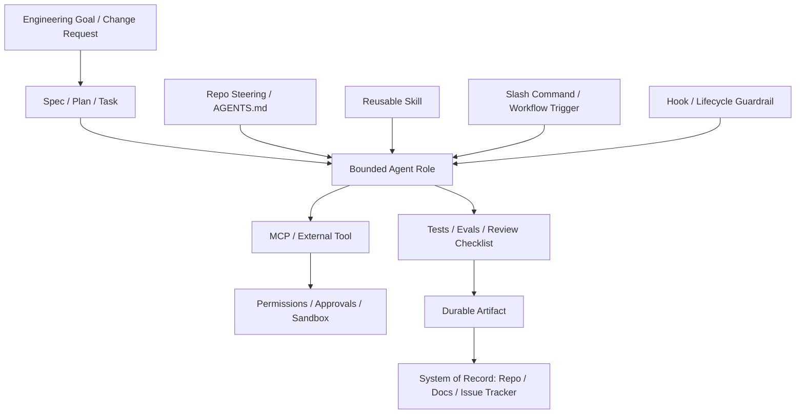

# Agentic Engineering Field Manual

## Designing Governed AI-Assisted Software Workflows

This field manual helps engineering teams structure repositories, agents, skills, tool access, verification evidence, and durable artifacts so AI-assisted software engineering can survive real team usage.

It is written for senior developers, staff engineers, software architects, platform engineers, and technical leads responsible for standardizing AI-assisted engineering workflows. Engineering managers, DevOps/platform leaders, and toolsmiths building internal AI engineering enablement are secondary readers.

This is not a beginner AI book. It is a practical, architectural, reference-oriented guide for moving from ad-hoc AI coding experiments to reliable, reusable, and governable engineering workflows.

## What this book is not

This is not:

- a prompt cookbook
- a beginner introduction to ChatGPT or coding assistants
- a generic agent framework tutorial
- a vendor-specific Codex, Claude Code, Cursor, Kiro, or MCP manual
- a replacement for software architecture, security review, testing, or engineering judgment

## Book promise

This field manual helps engineering teams move from individual AI coding experiments to structured, reviewable, and governable AI-assisted software engineering.

It focuses on the engineering system around agents:

- repository steering
- reusable skills
- bounded agents and subagents
- slash commands and workflow triggers
- hooks and lifecycle guardrails
- permissions, approvals, and sandboxing
- context and memory boundaries
- specs, plans, and tasks
- durable artifacts
- verification evidence
- MCP and external tool access
- team maturity and operating models

The **Nexus Engineering Control Plane** case study represents a fictional organization moving from ad-hoc assistant usage to a governed model with reusable skills, clear steering, bounded agents, and evidence-based verification.

## Reader paths

### I want to make one repository agent-ready

Read:

1. Why Agentic Engineering Needs Structure
2. Core Vocabulary
3. Steering
4. Skills
5. Verification, Tests, Evals, and Checklists
6. Repo Layout

### I want team-level governance for AI-assisted engineering

Read:

1. Why Agentic Engineering Needs Structure
2. Permissions, Approvals, and Sandboxing
3. Artifacts
4. Verification, Tests, Evals, and Checklists
5. Team Maturity Model
6. Anti-Patterns

### I want to design reusable coding-agent workflows

Read:

1. Skills
2. Slash Commands
3. Agents
4. Subagents
5. Specs, Plans, and Tasks
6. Artifacts

### I want to integrate tools and MCP safely

Read:

1. Tooling, MCP, and External Capabilities
2. Permissions, Approvals, and Sandboxing
3. Hooks
4. Verification, Tests, Evals, and Checklists
5. Anti-Patterns

## Reference architecture

## Agentic engineering maturity model

| Level | Pattern | Typical symptoms |
|---|---|---|
| L0 | Ad-hoc prompting | Useful outputs remain in chat; no repeatability |
| L1 | Individual discipline | Personal prompts and manual checks |
| L2 | Repository steering | AGENTS.md, repo conventions, local verification |
| L3 | Reusable workflows | Skills, slash commands, templates, repeatable artifacts |
| L4 | Governed tool use | MCP/tools, approvals, sandboxing, auditability |
| L5 | Engineering control plane | Metrics, policies, lifecycle management, portability |

Read this field manual as a reference: start with the vocabulary, then adopt chapters as design modules for your own repositories, team processes, and engineering control-plane decisions.
