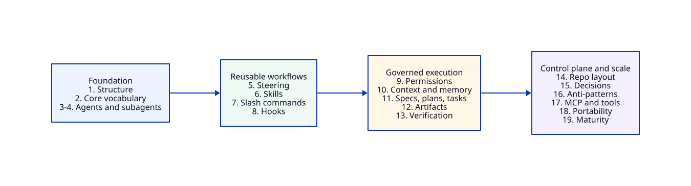
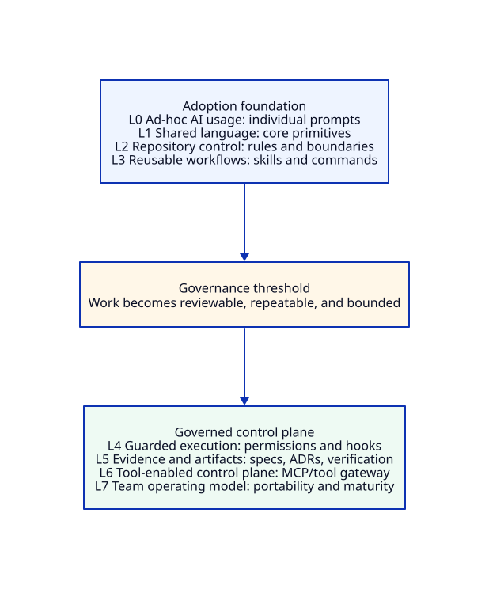

# How Nexus Evolves Through This Field Manual

Nexus Engineering Control Plane is the running case study used throughout this field manual.

Nexus starts as an organization where developers use AI coding assistants individually and inconsistently. Across the book, Nexus gradually adds structure: shared vocabulary, repo steering, reusable skills, bounded agents, delegated subagents, workflow triggers, hooks, permissions, context boundaries, specs, durable artifacts, verification evidence, tool access, repository layout, decision frameworks, anti-patterns, portability, and maturity assessment.

By the end of the book, Nexus should no longer look like "people using AI tools." It should look like an engineering control plane for governed AI-assisted software delivery.

Every chapter should answer:

> What does Nexus have after this chapter that it did not have before?

## Chapter-by-chapter evolution

| Chapter | Nexus state before | What this chapter adds | Nexus state after | New Nexus asset |
|---|---|---|---|---|
| Why Agentic Engineering Needs Structure | Developers use AI tools individually. Outputs are inconsistent. | The need for structure, governance, repeatability, and artifacts. | Nexus is introduced as a response to uncontrolled AI usage. | Nexus problem statement |
| Core Vocabulary | Teams use terms like agent, skill, tool, memory, and workflow loosely. | Shared language. | Nexus gets a common operating vocabulary. | Vocabulary map |
| Steering | Teams know they need structure, but repo rules still live in personal habit and scattered notes. | Repository doctrine, rules, local commands, and context. | Product repos begin to expose shared guidance through `AGENTS.md` or equivalent repo steering. | Sample repo `AGENTS.md` |
| Skills | Teams repeat similar prompts and review steps manually. | Reusable task playbooks. | Nexus starts converting repeated workflows into shared skills such as API-change review, ADR writing, and test-plan generation. | Sample `SKILL.md` |
| Agents | Nexus has steering and skills, but execution responsibility is still too broad. | Bounded agent roles. | Nexus defines role-specific agents that operate within steering and use skills. | Implementation-agent role contract |
| Subagents | The main agent role is bounded, but some review and analysis tasks need isolation. | Delegated isolated workers. | Nexus uses subagents for compatibility review, test planning, security checks, and documentation review. | Subagent delegation model |
| Slash Commands | Workflows are hard to trigger consistently. | Standard workflow triggers. | Developers use commands like `/plan-change`, `/review-pr`, and `/create-adr`. | Slash command catalog |
| Hooks | Humans remember guardrails manually. | Lifecycle automation and guardrails. | Nexus adds pre-change, pre-commit, pre-release, and evidence-check hooks. | Hook policy |
| Permissions, Approvals, and Sandboxing | Tool access is too broad or unclear. | Blast-radius control. | Nexus introduces permission tiers and approval rules. | Permission matrix |
| Context and Memory | Teams paste context randomly into chat. | Context boundaries. | Nexus separates repo steering, task context, durable memory, and transient chat. | Context boundary policy |
| Specs, Plans, and Tasks | Agents jump directly into code. | Structured work decomposition. | Nexus requires specs and task plans for risky changes. | Spec/plan/task template |
| Artifacts | Important decisions disappear in chat. | Durable outputs. | Nexus stores ADRs, specs, runbooks, PR evidence, and review notes in repos. | Artifact taxonomy |
| Verification, Tests, Evals, and Checklists | Agents claim work is done without proof. | Evidence and checks. | Nexus requires test output, review checklist, risk notes, and verification evidence. | PR evidence checklist |
| Incident Response and Rollback | Agentic changes that regress production are handled by improvisation. | Rollback criteria, escalation paths, and post-incident review. | Nexus has a rollback runbook, escalation path, and post-incident review process for agent-involved failures. | Incident response playbook |
| Repo Layout | Every repo organizes AI guidance differently. | Standard repo structure. | Nexus defines common layout for steering, specs, docs, artifacts, and skills. | Repository layout |
| Decision Frameworks | Teams do not know when to use agent vs skill vs tool. | Reusable decision tables. | Nexus creates decision frameworks for workflow design. | Decision framework |
| Anti-Patterns | Teams repeat the same AI mistakes. | Failure library. | Nexus documents god agents, mega-skills, fake verification, context flooding, and tool overreach. | Anti-pattern library |
| Tooling, MCP, and External Capabilities | Agents cannot safely access external systems. | Tools and connectors. | Nexus creates a permissioned tool gateway for CI, issue tracker, docs, and deployment metadata. | Tool adapter / connector contract |
| Tool Portability | Workflows become tied to one vendor. | Concept/tool separation. | Nexus separates core patterns from Codex, Claude Code, Cursor, Kiro, GitHub, and GitLab specifics. | Portability matrix |
| Metrics, Cost, and Spend Governance | Nexus has an operating model but no feedback loop. Spend is unattributed and verification quality is assumed. | Measurement and review loops. | Nexus instruments spend, verification rate, and governance health. Monthly review loops feed corrections back into steering and permission policy. | Metrics dashboard and spend governance policy |
| Team Maturity Model | Adoption is inconsistent across teams. | Maturity ladder. | Nexus becomes a measurable engineering operating model. | Maturity assessment rubric |

## Chapter progression

## Nexus capability layers

## Running workflow example

For the primary running workflow, this field manual uses a backward-compatible API contract change. See [Running Example](./running-example.md).

Chapters should normally reference that canonical page and adapt only the part of the example needed for the chapter.
